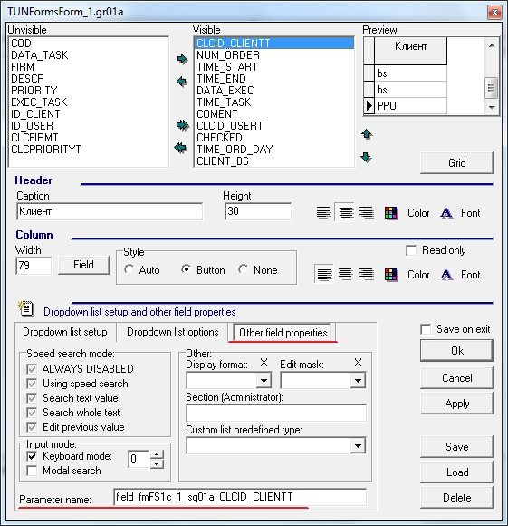
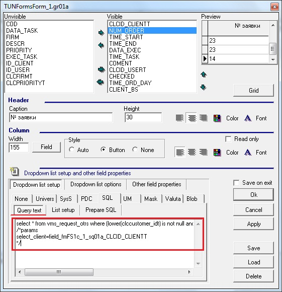
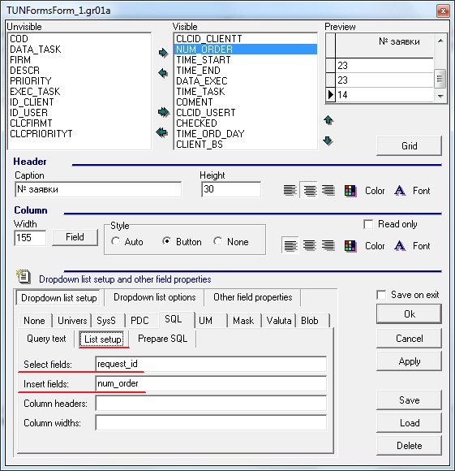
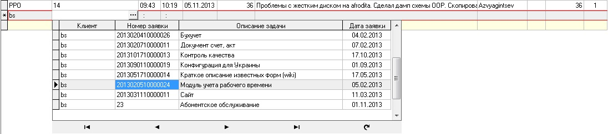

# Справочник произвольного типа \(SQL\)

**Настройка справочника произвольного типа по Alt+D.**

Для настройки выпадающего справочника, открываем окно свойств, где есть возможность настроить тип справочника, в нашем случае выбираем SQL.

Параметры справочника сохраняются в текстовом поле в INI-формате, но окно дизайна грида позволяет редактировать их визуально \(более наглядно\). 

На вкладке SQL есть дополнительные вкладки: 

Вкладка Query text

Содержит в себе SQL запрос, который будет выбирать данные из вьюхи, используемой в качестве справочника.

 Пример:

```sql
select * from vms_request_otrs 
where (lower(clccustomer_idt) is not null 
and lower(clccustomer_idt) = lower(:select_client)  
or lower(:select_client) is null) and clcstatust is null
```

Вьюха `vms_request_otrs` содержит данные о заявках клиентов и статус их выполнения.

Во вкладку Query text можно вписывать параметр, который может использоваться в запросе

Пример:

```sql
/*params
select_client=field_fmFS1c_1_sq01a_CLCID_CLIENTT
*/
```

 Параметр `select_client`, к примеру, может принимать значение из поля грида. Название поля можно узнать на вкладке Other Field Properties.



В итоге выпадающий справочник будет содержать данные из вьюхи `vms_request_otrs` с фильтром по указанному клиенту и незакрытыми задачами. Запрос с параметром указывается в во вкладке Query text.



Данные из 

Вкладка List setup

Содержит в себе два поля Select field и Insert field

В поле Select field вписывается наименование поля \(полей\) из справочника, а в поле Insert field вписывается наименование поля \(полей\), которые будут использоваться при вставке. Если необходимо указать несколько полей, то их нужно записывать через запятую.

Пример:

поле: Select field

значение: s\_param1, s\_param2

поле: Insert field

значение: i\_param1, i\_param2

При выборе данных из справочника, данные из полей s\_param1 будут заноситься в поле и  i\_param1, а данные из s\_param2 будут заноситься в i\_param2 соответственно



Данные из поля `request_id` будут занесены в поле `num_order`.

В итоге в поле № заявки получаем выпадающий справочник, дизайн которого также можно настроить по ALT+D



