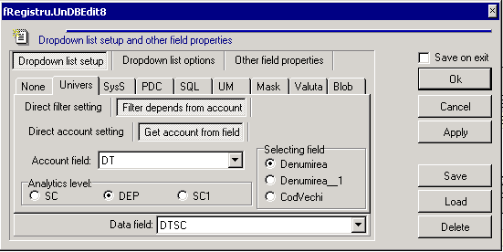
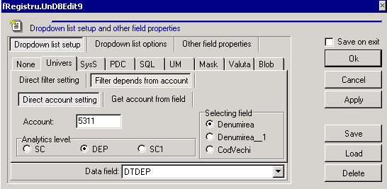
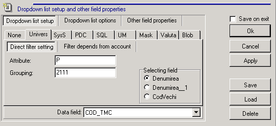
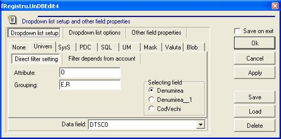

# Настройка справочника Univers

Возможность настраивать в дизайне грида параметры выпадающего справочника как произвольного SQL-запроса с использованием параметров по Alt + D . 

Параметры справочника сохраняются в текстовом поле в INI-формате, но окно дизайна грида позволяет редактировать их визуально \(более наглядно\). 

Ключевой параметр - TIP, значение которого определяет тип справочника.

Допустимые значения: U, S, P, I, i, M, Q.

Остальные параметры зависят от типа справочника:

**Тип U \(справочник Univers\):**

**FIELD\_COD -** поле, в котором сохраняется код Univers \(поле COD\)

**FIELD\_CONT** - счет или поле, в котором хранится счет

**U\_FILTER\_LEVEL** - уровень аналитики \(0: Sc, 1: Dep, 2:Sc1\)

**U\_FILTER\_TIP** - фильтр по полю TIP

**U\_FILTER\_GR1** - фильтр по полю GR1

При указании **FIELD\_CONT** фильтр определяется из плана счетов с учетом **U\_FILTER\_LEVEL**, а U\_FILTER\_TIP и U\_FILTER\_GR1 не используются.

При отсутствии параметра FIELD\_CONT фильтр определяется параметрами U\_FILTER\_TIP и U\_FILTER\_GR1, а параметр U\_FILTER\_LEVEL не используется.

Примеры:

 **пример 1**

TIP=U

FIELD\_COD=DTSC

FIELD\_CONT=DT

U\_FILTER\_LEVEL=0

**пример 2** 

TIP=U

FIELD\_COD=DTDEP

FIELD\_CONT=5311

U\_FILTER\_LEVEL=1

**пример 3**

TIP=U

FIELD\_COD=COD\_TMC

U\_FILTER\_TIP=P

U\_FILTER\_GR1=2111

В Alt+D на вкладке Univers в поле Grouping можно указать не только значение tms\_univers.gr1 \(например, E\),

но и доп.условие, например:

E\cod in \(select cod from vms\_univ\_org u where tip='O' and gr1='I' and u.TIPCLIENT\_S\_27 in \(1,2\)\)

или

I\|M - фильтр по gr2

**Пример: Настройка фильтра по полю tip и gr1. Вывести данные из univers O,R и O,E**

