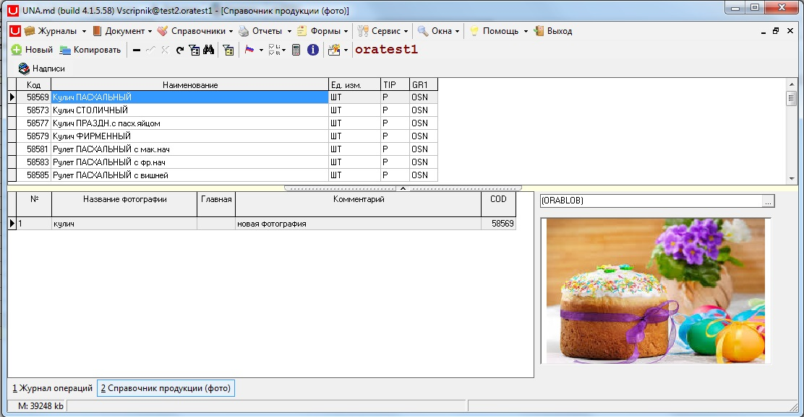
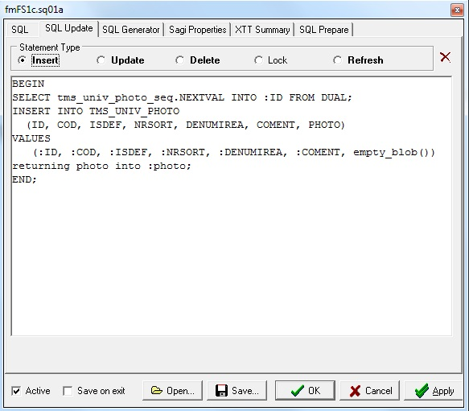

# Справочник с фото

Справочник с фото

[Обработка изображений](https://bsoft.gitbook.io/wiki/razrabotka/konfigurator/spravochniki/univers/spravochnik-s-foto/obrabotka-izobrazhenii)

Можно тестировать на nefis@oravirt форма 07. Справочник фотографий или ab@oravirt - Формы - Справочники - 07. Справочник фото или 01. Все товары.

1\) Создаем таблицу для хранения

```sql
create table tms_univ_photo
(
id int,
cod int,
isdef char(1 byte),
nrsort varchar2(30 byte),
denumirea varchar2(100 byte),
coment varchar2(4000 byte),
photo blob,
constraint tms_univ_photo_pk primary key (id)
,constraint tms_univ_photo_fk foreign key (cod) references tms_univers (cod)
,constraint tms_univ_photo_ck check (isdef is null or isdef='1')
,constraint tms_univ_photo_uq unique (cod,isdef)
);
create index tms_univ_photo_fk on tms_univ_photo (cod);
create or replace trigger tms_univ_photo_tr
before insert or update on tms_univ_photo
for each row
begin
if inserting and :new.id is null then
select id_tmdb_cm.nextval into :new.id from dual;
end if;
if :new.isdef<>'1' then
:new.isdef:=null;
end if;
end;
/
```

 2\) Для примера сделаем форму Справочник продукции \(фото\)



 Настройка формы в конфигураторе

| **Имя свойства** | **Тип** | **Описание** | **Значение для примера** |
| --- | --- | --- | --- | --- | --- | --- | --- | --- | --- |
| Active | Boolean |  | true |
| Caption | String |  | Справочник продукции \(фото\) |
| DLL FormName | String |  | FSal1p01 |
| DLL ID | Integer |  | 8101 |
| DateCount | Integer | 0..2 \(dates in header\) | 0 |
| FormUseDetail | Boolean | 2 grids | true |
| MasterSize | Integer | &lt;0 means vertical | 300 |
| **PanelHeightTab1** | Integer | отображение грида и детайла внизу, с общим запросом | -365 |
| **QueryTab1aTransAuto** | Boolean |  Отключить автономные транзакции в табе с изображением |  false |

Настройки по Alt+Q [фото.dzn](http://wiki.bsoft.biz/xwiki/bin/download/%D0%A0%D0%B0%D0%B7%D1%80%D0%B0%D0%B1%D0%BE%D1%82%D0%BA%D0%B0/%D0%A1%D0%BF%D1%80%D0%B0%D0%B2%D0%BE%D1%87%D0%BD%D0%B8%D0%BA+%D1%81+%D1%84%D0%BE%D1%82%D0%BE/%D1%84%D0%BE%D1%82%D0%BE.dzn)

Обязательно для поля фото используются функция EMPTY\_BLOB\(\) – функция возвращает LOB локатор для BLOB колонки. \( [объекты \(LOB\) в ORACLE](http://apps-oracle.ru/lob_oracle/) \)

Так же настраиваться поле PHOTO на вкладке Update.



В справочниках типа univers можно добавлять карточку \(Cartela\) для ПРОСМОТРА фото, на карточке не получилось настроить добавление фото.

