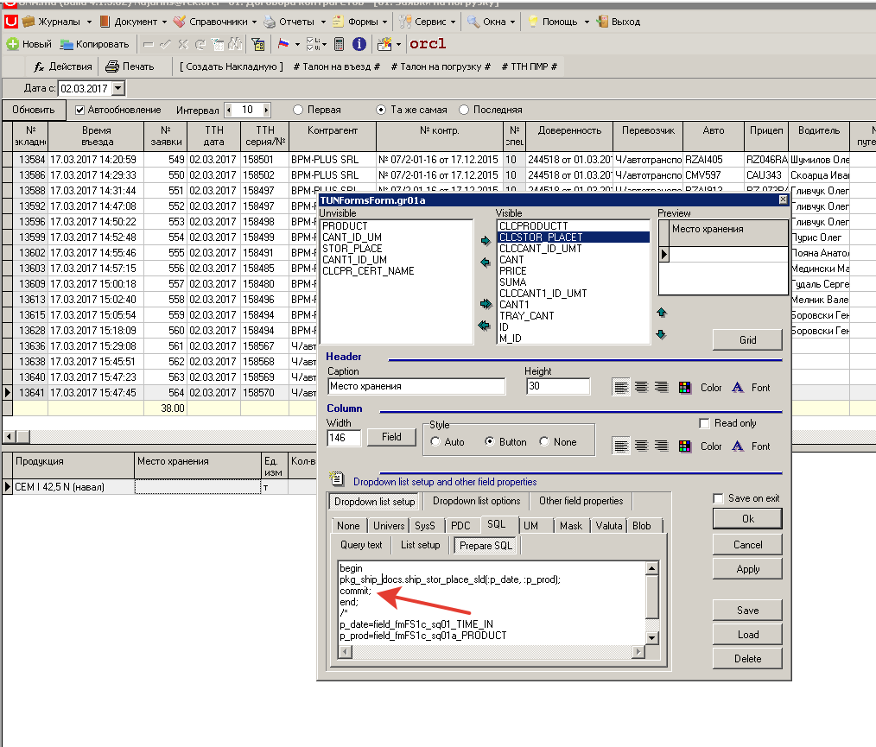
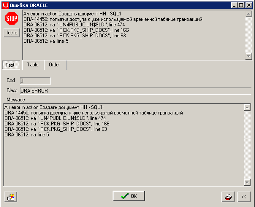

# un$sld.make ORA-14450

1. Если вызываем Un$sld.Make в пределах одной сессии и одной транзакции, не передавая параметр pTableName \(т.е. без id в таблице xsld\), то иногда может возникать ошибка блокировки.

2. Если используем в гридах Prepare SQL:

Prepare Sql блокирует xsld в основной сессии



Иначе последующие изменения xsld в автономных транзакциях\(т.е. в Экшенах\) бьют ошибку блокировки xsld:

Например, в проводках документа:

```sql
procedure ship_inv_tax_gfc(p_nrdoc number) is
  v_valuta varchar2(3 byte);
 begin  
  delete from vmdb_cmi where nrdoc=p_nrdoc;
  delete from xsld where id='ship_inv_tax_gfc';
  un$sld.make(nvl(abm_util.data_by_nrdoc(p_nrdoc),sysdate),'ship_inv_tax_gfc','ACDE12','2131');
```



3. ****Так же возникает конфликт доступа к xsld в экшенах\(автономная транз.\) с остатками после построения отчетов в УО.

Автономные транзакции вызываются Уной в экшенах, гридах.

**Для устранения ошибки** необходимо в каждой транзакции текущей сессии выполнять commit.

**Второй вариант решения проблемы:**

использовать другую временную таблицу при подсчете остатков \(вместо xsld\)

Для этого была доработана функция **un$sld.make**:

Добавлен параметр **p\_cTable - имя таблицы для накопления остатков**.  
Для избежания конфликта доступа к таблице xsld из автономной транзакции можно вызывать остатки с другим именем таблицы \(напр. XSLD\_SHIP - для отгрузки\).

Структура новой таблицы должна быть идентична xsld.

