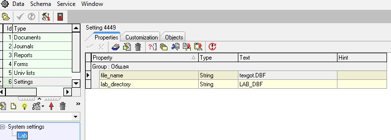
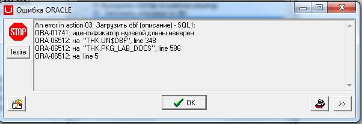

# Импорт из DBF

  
Для импорта из \*.dbf можно использовать утилиту Toad, в меню выбрать DataBase – Import – Import Table Data.

Далее необходимо выбрать таблицу, в которую будут импортированы данные, выбрать тип файла и  указать соответствие столбцов источника и приемника \(Destination - Source\).

Настройка импорта из dbf в UNA.

1. В конфигураторе создать узел \(или использовать уже существующий\) и добавить свойства:

**file\_name** – имя dbf файла \(с учетом регистра\)

**mat\_directory** -имя директории \(это ссылка на каталог сервера, где будет храниться dbf файл\)

Например: узел Lab \(лаборатория\)



2. На сервере создаем папку lab\_dbf

Например: \\имя сервера\lab\_dbf 

2. В Toad создаем директорию

Например:  create or replace directory LAB\_DBF as '/var/un4/lab\_dbf';

3. В Toad под sys даем grant на директорию

Например:  grant read, write on directory LAB\_DBF to схема;

4. Добавляем экшен "Загрузить из dbf" в документ или форму.

Если при выполнении экшена - Загрузить из dbf, программа бьет ошибку «идентификатор нулевой длины не верен», то надо проверить тип dbf \(скорее всего стоит vfp3\) 

Тип структуры, можно проверить через утилиту total commander \(F3 - открывает файл, F6-структура файла\).



Чтобы изменить тип структуры БД, надо скачать редактор.

Например Sdbf 4.5 c сайта : [http://habrahabr.ru/sandbox/73266/](http://habrahabr.ru/sandbox/73266/) или [Sdbf 4.5.zip](http://wiki.bsoft.biz/xwiki/bin/download/%D0%A0%D0%B0%D0%B7%D1%80%D0%B0%D0%B1%D0%BE%D1%82%D0%BA%D0%B0/%D0%98%D0%BC%D0%BF%D0%BE%D1%80%D1%82+%D0%B8%D0%B7+DBF/Sdbf%204.5.zip)

Запускаем программу Sdbf 4.5 и в меню выбираем Файл - Открыть, выбираем нужный dbf файл. Далее в меню Таблица - Изменить структуру, в поле Тип файла выбрать - xBaseIII и нажать кнопку сохранить.

Загружаем файл в нашу папку на сервере с измененным типом структуры БД.

5. Пример экшена "Загрузить из dbf"

```sql
-- в начале пакета добавить переменные
v_directory varchar2(100) := pkg_adm_util.get_adm_text('lab_directory','','LAB');
v_file_name varchar2(100) :=pkg_adm_util.get_adm_text ('file_name', '', 'LAB');
--
procedure fill_from_dbf
is
begin
 --чистим временную таблицу (У нее должна быть такая же структура, как у файла dbf)
 delete from ztmp_texgot_dbf;
 -- процедура загрузки из файла во временную таблицу
 un$dbf.load_table(v_directory,v_file_name,'ztmp_texgot_dbf');
/*... далее используем временную таблицу ...*/
end; 
```


