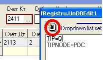
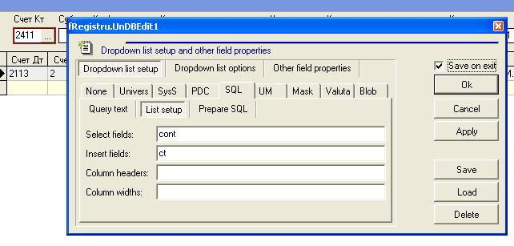

# Процедура set\_conts\_list

В пакете `pkg_pdc_util` описаны две перегрузки процедуры `set_conts_list` с параметром и без. 

Если вызывать процедуру без параметров, то она возвращает список всех счетов.

Например: 

```sql
pkg_pdc_util.set_conts_list();
```

 Если нам нужен список счетов или их группа, то можно передать значения в процедуру следующим образом, например:

```sql
pkg_pdc_util.set_conts_list('2 3 5421 9111');
```

 В конфигураторе определен справочник CustomList - PDC, его определяют параметры: 

| **Название свойства** | **Тип** | **Описание** | **Значение для примера** |
| --- | --- | --- | --- |
| PSQL | Memo | текст предварительного SQL \(Prepare SQL\) | `begin pkg_pdc_util.set_conts_list(); end;` |
| SQL | Memo | текст основного запроса | `select * from vtmp_tms_pdc` |
| SagiEditQuery | Boolean | для исправление запроса справочника | `true` |

В клиенте для объекта, где используется такой справочник, необходимо произвести следующего вида настройки: 

Например:

Выбираем объект и открываем настройки сочетанием клавиш **Alt+D** и выбираем вкладку **SQL.**

Нажимаем на блокнотик \(который выделен на изображение\) и прописываем название справочника: **TIPNODE=PDC**



Потом еще раз нажимаем эту кнопку и возвращаемся в настройки, выбираем **List setup,** где прописываем соответствующие поля, cont- поле которое выбираем , ct - поле в которое происходит заполнение \(insert\). 

Ставим галочку Save on exit и сохраняем \(кнопка Ок\).



После выполненных действий в поле Счет Кт будет выпадать справочник всех счетов.

Чтобы ограничить справочник, нужно в настройках объекта Счет Кт  в Prepare SQL прописать вызов процедуры и задать необходимые параметры.

Например:

```sql
begin
pkg_pdc_util.set_conts_list('3 2411');
end;
```


