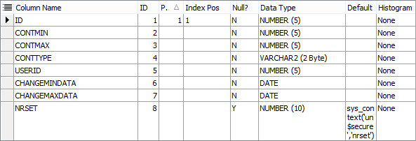

# Структура Базы Данных

Значит сегодня поговорим про структуру базы данных, мы не говорим про саму программу, про её интерфейс, я просто расскажу из чего состоит база данных, основные функциональные элементы, тоже постараемся не очень подробно, а так на уровне идей. Работаем с базой данных Oracle используем программу Toad для просмотра и редактирования объектов. В первую очередь какие схемы. Во-первых есть схема Sys, схемы User одинаковые  \(синонимы в Oracle\)  Схемой Sys мы заходим для выполнения всяких функций. Например создать пользователя, сделать экспорт базы, импорт базы. Кстати такая есть ошибка, когда люди делают экспорт от имени того пользователя, который владелец данных. В этом случае могут выгружаться не все данные. Запомните сразу, если делаете какие-то операции по импорту/экспорту, надо делать от имени Sys или System с правами SysDBA.

  Смотрим Shema Browser смотрим какие здесь есть пользователи\(Users\) . На одном сервере мы можем хранить сразу несколько схем, хранящие данные разных предприятий. Но есть вот такие схемы как UN4PUBLIC, она обязана присутствовать на сервере в единственном экземпляре. Т.е. если у вас на сервере 10 предприятий, у вас будет 10 схем предприятий и 1 схема  UN4PUBLIC. Если у вас на сервере 1 предприятие, это его схема, значит есть схема предприятия и есть схема  UN4PUBLIC. UN4PUBLIC хранит общие какие-то алгоритмы, которые вынесены в отдельную схему. Кроме этого есть еще такие схемы, как UN4PACK и UN4$REPOZITAR, они так же как UN4PUBLIC должны присутствовать в единственном экземпляре. UN4PACK позволяет работать по очень тонкому каналу, но в наше время и мегаинтернета это не актуально. Т.е. это отдельные схемы, где крутится отдельная служба, позволяющая запаковывать какие-то данные, которые предназначены для пересылки, а клиент умеет очень хитро в запакованном виде всё это получать и распаковывать. Уменьшается трафик, ускоряется немножко загрузка дизайнов и конфигурации при старте программы.  Ну вот это общие слова про схему UN4PACK. UN4$REPOZITAR  появилась тоже относительно недавно, и она еще даже присутствует не на всех клиентах. Это набор справочников, которые общие для всей республики, например список предприятий, экономических агентов,  да, он один, зачем его у каждого дублировать свой. Там различные списки, справочники, которые используются для построения отчётов, стандартных форм. Там перечень категорий служащих например как сейчас установлен законодательством на какие-то категории, но это для Молдовы актуально, для Тирасполя видимо нет. Т.е. вот в UN4$REPOZITAR задумка такая, что эта схема распространяется сама по себе и у нас будут механизмы для её обновления.  Мы можем просто к клиенту придти,  поставить ему новую обновленную схему UN4$REPOZITAR, у него ничего своего там нет, просто он получил новый справочник. Но это как я уже сказал не актуально. Самое главное, это мы говорим про схему UN4. Значит традиционно так сложилось, что UN4 так называлась схема, которая хранит основные бухгалтерские данные предприятия. Когда на одном сервере используется несколько предприятий, как я уже говорил, то схемы могут называться иначе по имени клиента, например MTC это МолТелеКом, там TUTUN,PANILINA, ARTIMA и так далее, но если мы делаем на клиенте где-то ставим, то можно традиционно поставить там схему UN4 и будет понятно, что именно UN4 содержит данные предприятия. С другой стороны, чтобы удобно было импортировать/экспортировать данные от клиента в офис, из офиса в клиент, здесь мало вероятно, что вам удастся создать схему с именем UN4 для вашего личного клиента. Вот например TUTUN, здесь мы храним копию на какой-то момент принесли нам архив базы данных с предприятия TUTUN. Значит у них на фабрике на табачной схема называется так же TUTUN, при это при импорте, экспорте не нужно указывать, что от пользователя такого-то к пользователю такому-то. То есть есть свои удобства при именовании схемы одинаково как в офисе, так и на клиенте. Вот, ну это что касается о соглашении. Теперь давайте зайдем на схему UN4 и посмотрим из чего она состоит. Традиционно у нас пароли на схемы совпадают с именем схемы. Потому что всех паролей не упомнишь. Открываем Shema Browser. Данные как вы все уже знаете хранятся в таблицах. Таблиц в данном случае 470. Т.е. разобраться во всём этом безобразии кажется сложным. На самом деле есть очень простая система и есть некие соглашения об именах, т.е. само название таблицы может вам уже с определенной долей вероятности сказать что это за таблица и какую функцию она выполняет. Значит вот таблицы, все таблицы мы можем разделить на 3 категории: оперативные данные, справочные данные и системные данные. Что такое оперативные данные?

###  **Таблица TMDB\_DOCS**.

 Это в первую очередь таблица TMDB\_DOCS и связанные с ней таблицы. Таблица TMDB\_DOCS ключевая вообще в понимании нашего оперативного учета. Одна запись в таблице TMDB\_DOCS это один документ. Документ - это единица измерения всех оперативных данных. Каждый документ это в первую очередь запись в TMDB\_DOCS.


Первичный ключ поле COD, вот это поле COD оно в других таблицах может называться NRDOC, но это для ссылки на это поле COD. Вторым по важности после COD'a идёт DATAMANUAL-это дата, которая вручную вбивается операционистом, это дата проведения документа. Поэтому она называется DATAMANUAL так как она вручную вводится. И есть SYSFID, вот такое сложное поле, которое содержит просто число, но это число описывает тип данного документа. И каждому документу будут применяться те или другие алгоритмы, для работы с ними  в зависимости от вот этого вот типа.  Т.е. если изменить тип документа, то чаще всего вы получите какую-то невообразимую ошибку. Т.е. все перестанет работать. Но иногда это очень удобная операция. Приведу пример, вот у нас был документ табель учета рабочего времени и описан он был не очень удачно и было решено переделать этот документ. В результате документ был переделан с полностью другой реализацией, но новый документ использовал те же самые таблицы Oracle просто по-другому с ними работал. Был создан новый документ, у него был соответствующий новый SYSFID, затем у старых, у уже введённых документов мы просто Update поменяли SYSFID на новый и получилось, что те документы, которые уже введены, с теми же своими данными уже обрабатываются новым алгоритмом, новыми методами работы, по-другому, другой интерфейс у них, но важно что в Oracle представлены они были одинакого, поэтому в этом случае представленная операция допустима. Смена SYSFID приводит к смене использования программных кусков. USERID обычно присваивается автоматически триггером, то есть клиент устанавливает, триггер устанавливает  текущего пользователя, кто в систему зашел. NRMANUAL -это ручной номер, то есть он в каких-то алгоритмах не участвует, но удобен для визуального просмотра документов и выбора то есть как правило у любого документа есть первичный бумажный документ, там какая-то накладная или какой-то приказ и у этого документа есть свой номер, под которым он зарегистрирован. И вот мы   в NRMANUAL вводим этот номер  и бухгалтеру удобно пользуясь этим полем найти соответствующий электронный документ по бумажному документу. Все остальное это уже системные поля. В DOCCOLOR рассчитывается цвет документа, то есть когда документ нормальный, с проводками, он выглядит желтым цветом, если он без проводок, то он серым цветом, если он дезактивирован, то он голубым цветом. То есть DOCCOLOR  возвращает атрибуты для правильной расцветки документа. Поля F, M и DIV служат для управления видимости документа в зависимости от каких-то правил, от каких-то политик безопасности. Поле DIV, например если у нас фирма делится на какие-то филиалы, мы заводим перечень филиалов и каждый документ или каждая проводка может относиться к определенным филиалам. В поле DIV прописывается соответствующие значения и затем на интерфейсе пользователь может выбрать просмотр данных только по какому-то филиалу или по группе филиалов или только по центру. И работает  POLICY. POLICY это автоматически накладываемый фильтр, то есть когда на какую-то таблицу включена POLICY \(политика безопасности\), то при работе с этой таблицей, мы можем видеть не все записи, а только часть, выбранных по определенному фильтру и фильтр задаёт это самое POLICY. POLICY может работать динамически, то есть в каждый момент при обращении к таблице, будет вычисляться какое-то значение фильтра, в зависимости от текущего контекста. Таким образом вот установил человек какие-то фильтра по филиалам, установились соответствующие значения для  POLICY. POLICY фильтрует и документы и проводки  так, чтобы человек видел данные только по своим филиалам. Вот такая простая система, вот для этого служит поле DIV. Поля F и M нечто подобное. Вот это мы говорили все про таблицу TMDB\_DOCS \(таблица документов\). Вторая по важности таблица как видно здесь, она не в какую категорию не попала, она сама по себе,  это таблица TMDB\_CM.

### Таблица TMDB\_CM.


Это таблица проводок. Она имеет очень сложную структуру.

Во первых первичный ключ. Рекомендация при знакомстве с таблицей в первую очередь смотреть на первичный ключ. Это показывает место это таблицы в общей иерархии. Мы увидим, что первичный ключ состоит из 3-х полей NRDOC\(номер документа\), COD\(код проводки\) и некий SPTYPE. Значит NRDOC это понятно, номер документа к которому относится данная проводка. COD просто код проводки внутри документа. SPTYPE расширяет первичный ключ от 2-х до 3-х полей  так, чтобы можно было с одним и тем же кодом, сделать несколько записей. SPTYPE может принимать значения 0,1 и 2. Значение 0 это обычная проводка. Значение 1 это для ускорения расчетов, отражение этой же проводки наоборот. Когда аналитика кредит попадает в дебит, кредитовая аналитика пустая, а все суммы и количество указаны с минусом. SPTYPE =2 это когда мы вводим зарегистрированное сальдо. Давайте будем рассматривать записи SPTYPE=0.  \[вкладка Data\] Вот мы видим обычную таблицу проводок. Вот документ 75464, 75466, 75467. Можно поставить фильтр SPTYPE=0. Какие поля нас интересуют в проводке? Поле FUNCT используется различными алгоритмами, то есть бывает так, что в одном документе есть несколько  групп проводок. Группа проводок по основному движению материалов, группа проводок по начислению налога на добавочную стоимость \(НДС\), какая-нибудь группа проводок по  начислению каких-то скидок клиенту. То есть поле FUNCT призвано различать вот такие проводки по группам для того, чтобы можно было делать какие-то перерасчёты. Например удалить только проводки по НДС и снова перепровести НДС. Или скидки, изменились параметры начисления скидок, мы удалим только проводки со скидками и снова перегенирируем. Вот для таких целей используется поле FUNCT \(Function\). ISVALID это поле, которое должно содержать Null. Если поле содержит не Null, значит данная проводка дезактивирована и не попадает в бухгалтерский учет. Бывает так, что мы ввели документ, удалять мы его не хотим, но мы хотим увидеть как все будет если бы этого документа бы не было. И мы дезактивируем документ. При этом ставится флаг на таблице TMDB\_DOCS и триггер соответствующие флаги ставит на всех проводках этого документа. В ISVALID попадает по-моему 1 и соответственно все расчеты в бухгалтерских отчётах везде это стоит проверка ISVALID is Null. Соответственно исключается группа проводок из бух. учета. Поле CODFCDEBAZA . FC это Formule Contabele \(это проводки\).

Бывает так, что нужно видеть связь между 2-мя проводками. Классический случай- когда мы начисляем НДС на какой-то оприходованный товар, у нас есть 10 проводок по приходу товара и 10 проводок по НДС и мы хотим точно знать какая проводка по НДС, на какой товар отнесена. В этом случае в поле CODFCDEBAZA  в проводках по НДС попадёт поле COD  той проводки, на которую она ссылается. То есть это код базовой проводки. Группа проводок 1-го FUNCTION'a создались, получились какие-то коды.  Это просто оприходованный товар. Генерируется вторая группа проводок и мы сами сознательно в CODFCDEBAZA вставляем коды уже сгенерированных проводок, чтобы потом отчеты могли проследить эту зависимость. Соответственно бывает так, что проводка ссылается на проводку из другого документа. Это конечно очень редкий случай. Как правило такого не происходит. Если вы оставляете поле NRDOCFCDEBAZA пустым, оно заполняется своим же номером документа. Но если вы укажете здесь другой номер, то получится, что вы ссылаетесь, на проводку из другого документа, вот ей код \(CODFCDEBAZA\). Теперь поговорим по аналитике. Аналитическая часть проводки, она продублирована, группа полей, включающая буквы DT и есть такой же набор полей, включающий буквы CT и количественно-суммовые поля CANT, SUMMA, SUMAVALDT. Самое главное поле в проводке, это DT и CT \(это счет по дебету, счет по кредиту\). Это значение из плана счетов. Поле DT1 предусматривалось как субсчет, но мы используем субсчет как 4-я цифра счета. То есть если принят 3-х значный план счетов \(221\), мы пишем 2217,  где 7 практически и есть субсчет. Поэтому поле DT1 может быть использовано на ваше усмотрение для какой-то дополнительной аналитики для разделения проводок по типам. Например, мы  в коммерческом департаменте МолТелеКома именно в этом поле указывали когда начисляются какие-то деньги за услуги пользователю, но он имеет какие-то скидки, и еще  бывают скидки разного рода, то мы этим полем отличали проводки, 0 это обычное исчисление,  1 это какие-то скидки 1-го рода, 2 - скидки другого рода. И если брать сумму счета без аналитики DT1, то все складывалось, а в скидках шли суммы с минусами и получается, что мы видим сразу с учетом скидки то, что человеку пошло, но если мы получим в разрезе DT1, CT1, то мы сразу увидим структуру начисления, что базовая сумма была такая, скидка была такая, скидка 2-го рода была вот такая. Вот пример использования поля DT1. В любом случае мы считает сумму по проводкам, поэтому если эта аналитика не будет включена, то  проводки просуммируются и придут одной цифрой. DTSC, DTDEP и DTSC1 это три поля, ссылающихся на универсальный справочник TMS\_UNIVERS. У нас есть универсальный справочник аналитики, где одно поле COD является первичным ключом, у него есть название, у него еще есть какие-то атрибуты, мы сделали так, чтобы любая аналитика проводок, будь то какие-то центры затрат, подразделения, филиалы, контрагенты, сотрудники, физические и юридические лица, материальные ценности, основные средства, все перечислено в одной таблице TMS\_UNIVERS. Удобство в том, что достаточно в проводке указать какое-то число в DTSC и любой подселект легко вытащит атрибуты из таблицы TMS\_UNIVERS. То есть мы всегда знаем, что число в поле DTSC,DTDEP и DTSC1 это какой-то код по таблице TMS\_UNIVERS. А сама таблица TMS\_UNIVERS имеет какие-то атрибуты, позволяющие отличить это у нас сотрудники, материал или продукция, контрагент. DTSC DTDEP и DTSC1 появились исторически, поэтому они вот так странно называются. SC это субконто. Когда понадобилось какое-то субконто, ввели DTSC-получилось субконто. Когда нужно было учитывать склад \(Depozit\), на каком складе лежит данное субконто, ввели поле DTDEP, получился учет по DTSC и по DTDEP. И возникли ситуации, когда этих 2-х аналитик не хватало, нужна была 3-я. Допустим статья расходов, на которую отнести данный товар на данном складе и так чтобы не особо изобретать, дали название DTSC1, что означает еще одно DTSC. Соответственно в кредите мы увидим CT, CT1, CTSC, CTDEP, CTSC1. Дальше идет аналитика DTNRDOC. DTNRDOC это возможность сослаться на какой-то другой документ, даже не обязательно на документ, это может быть ссылка на контракт. В общем это может быть любая ссылка на число, но  не являющаяся кодом по TMS\_UNIVERS. Когда например у нас есть контракт, а затем по этому контракту идут какие-то проводки. Вот в DTNRDOC,   СTNRDOC прописан контракт. И затем можно найти какие проводки по какому контракту были проведены. DTSTRSC. DT отбрасываем и остается STRSC. Это читается String Subconto. То есть это поле Varchar\(2\)  15 Byte, небольшое. Оно функционально служит как DTNRDOC, просто отличие в  типе. То есть сюда можно положить не числовую аналитику. Бывает, что число, но чтобы впереди сохранились 2 ведущих нуля. 00,315. DTNRDOC\(Number\(10\)\) отрежет два нуля. Уже значит используем DTSTRSC. Бывает нужно хранить там серию номенклатуры, но практика показывает, что как правило в DTSTRSC мы все равно храним числа, просто они хранятся в символьной форме.  Т.е. назначение такое же как у DTNRDOC. DTNRCM  тоже числовое поле. Это поле, участвующее в фильтрации наподобие DIV. Когда группу проводок должны менять свою видимость в зависимости от выбранного для пользователя фильтра, то это делается через поле DTNRCM, СTNRCM. И есть еще 4-я аналитика типа DATE. Вот эта тоже была заведена, когда была необходимость. Иногда нужно чтобы  проводка имела признак именно типа DATE, чтобы можно было быть уверенным, что с ней можно делать какие-то операции. Классический случай- начисление заработной платы, всяких удержаний  сотрудников. Нам важно не только сколько мы ему начислили и по какой статье, а еще за какой месяц. Здесь прописывается дата, как правило на начало месяца или на конец месяца и все движения по з/п одного сотрудника на один месяц имеет здесь одинаковое значение, на какой вы выберете. Вот  еще одна аналитика типа DATE. Дальше есть сумма в валюте SUMAVALDT, SUMAVALСT\) у нас отдельно по дебету, отдельно по кредиту. Такая специфика учета, бывает что мы приходуем в валюте, но кредитовая часть там почему-то леевая. Или бывает, что мы делаем какие-то переводы денежных сумм, с одной на другую. Поэтому сумма по дебету, сумма по кредиту может отличаться и в том числе может отличаться и валюта. Поэтому VALUTADT это обязательный атрибут поля SUMAVALDT. То есть VALUTADT описывает в какой валюте выражена SUMAVALDT, VALUTAСT описывает в какой валюте выражена SUMAVALСT. Часто бывает нам не нужен валютный учет, но нам нужен многосуммовой учет. Одновременно одна и та же проводка должна хранить несколько количественно-суммовых показателей и нам не хватает стандартного поля SUMA и CANT и мы начинаем использовать SUMAVALDT, SUMAVALCT, зная что он обрезает до 2-х знаков, но нас это допустим устраивает, мы храним в них совершенно другие вещи, но в данных конкретных проводках  по данным конкретным счетам  специальные алгоритмы это правильно обрабатывают. Классический пример это  табачная фабрика. Они учитывали табак. Табак нужно учитывать во-первых в килограммах, а во-вторых в пачках. Надо знать сколько пачек табака, но сколько это кг. Кроме этого табак лежит на улице, отсыревает или высыхает и вес его меняется. Они проводят лабораторный анализ табака, вычисляют некий коэффициент, на который надо домножить   его реальный вес, чтобы получить учетный вес табака. Учетный вес табака таким образом не меняется. Он намок-стал тяжелее, но они замерили влажность, увеличили коэффициент, пересчитали - учетный вес табака не изменился.  Значит в проводки попадает реальный вес, учетный вес, количество КИП. Вот такие вещи.  Для этого использовалась SUMAVALСT и SUMAVALDT. Дальше есть SUMAGAAP это поле тоже было введено для решения каких-то определенных задач, которые потом отпали. И поэтому оно осталось программисту как  дополнительное суммовое поле, в которое можно что-либо положить и потом от туда взять.

**Количество.**

Есть обычное количество CANT, которое одно на проводку, так же как SUMA. И есть вот такое CANT1, которое разное по дебету и по кредиту. То есть вы можете использовать в дебетовой части одно количество, в кредитовой другое, если есть такая необходимость. Это по количественным полям. DTDIV, CTDIV. В TMDB\_DOCS есть поле DIV. А в проводках 2 DIV    DTDIV и CTDIV. Бывает, что какой-то материал, идет внутреннее перемещение из одного подразделения в другое, тогда по кредиту он должен относиться к одному подразделению, по дебету к другому подразделению. Мы не можем описать его каким-то одним DIV. То есть обычно в проводке DTDIV и CTDIV совпадают, за исключением тех случаев когда идет внутреннее перемещение, в этом случае они разные. И если  мы выберем только один DIV, мы увидим в проводке только её дебетовую часть. Мы увидим-да, действительно, приход есть. Если мы выберем фильтр по-другому DIV, мы увидим расход, да, действительно расход есть. То есть и там и там она будет видна за счет того, что у нее разные значения \(DTDIV, CTDIV\). Теперь поговорим про SPTYPE. Вот одна и та же проводка. Документ NRDOC 15307, код проводки COD 26501 и SPTYPE 0 и 1. 1 - это проводка, которая дополнительная к той основной для удобства подсчета сальдо. Ведь как считает сальдо? Остаток на какую-то определенную дату. Надо посчитать сумму всех сумм, количеств, где интересующая нас аналитика прошла по дебету, затем посчитать сумму всех сумм и количеств, где аналитика прошла по кредиту, взять это дело с минусом, сложить с тем  первым селектом, опять просуммировать, опять  сгруппировать. То есть приходится делать 2 действия. Один раз просуммировали UNION ALL все с минусом по кредиту, снова просуммировали снова сгруппировали. а для ускорения таких выборок было принято такое решение, то есть всякая  проводка, когда записывается она записывается обычным образом, как мы сейчас описали + делается парная с ней проводка, где SPTYPE=1 и кредитовая аналитика попадает в дебетовую часть, но суммы идут с минусом.  И таким образом, чтобы посчитать сальдо на какую-то дату, недостаточно взять сумму по аналитике только по дебету, но уже включить фильтр 0 и 1 SPTYPE. И я сразу увижу и дебет и минус кредит и все это в одно действие получаю сальдо. Вот это ускорение. Важно следить за этим триггером, который формирует вторую  половину проводки. Если этот триггер ломается, теряется, отключается, то получаются расхождения, когда основная часть проводки есть, а парной для неё нету.  И тогда если мы посчитает отдельно оборот дебет/кредит оно есть, посчитаем сальдо - оборотов нет. Оборотов по кредиту мы не видим потому, что мы ищем этот кредит не в правой части SPTYPE=0, а в левой части, где SPTYPE=1. Бывает наоборот, обратная ситуация, что каким-то чудом  существует проводка с SPTYPE=1, но нет для нее основной проводки с SPTYPE=0. Тогда при расчете сальдо мы видим какой-то кредит, но когда мы видим обороты этого месяца- мы его не видим. SPTYPE=2 зарегистрированное сальдо. Когда у предприятия очень много движения, оборотов, оно работает ни один год, то каждый раз считать остатки  за все года бывает сложно. Мы принимаем решение на какой-то конец года, на закрытый период  зарегистрировать сальдо. Это делается например с заделом на конец года. Зарегистрированное сальдо, первый его признак, проводки имеют дату  ни ровно один день, а какой-то день и время 23 00 00. То есть это для того, чтобы они не попадали в обороты предыдущего дня, ни в обороты следующего дня.  Если я возьму за декабрь, где с 1-го по 31-е  декабря они не попадут, потому что у них дата больше. Если я возьму  с 1-го января по 31 января они тоже не попадут, потому что у них дата меньше. Они как бы между дат таким образом располагаются. И есть специальная таблица, где мы храним даты, на которые зарегистрированы сальдо. Сальдо нужно регистрировать по всем 7 счетам сразу. Если считаются остатки на февраль, то алгоритм смотрит:"У меня есть зарегистрированное сальдо на 31-е декабря". И тогда в селект, который выбирает все движения попадает период с 23 часов 31 декабря по интересующую нас дату. Мы захватываем сальдо, мы захватываем обороты за период после регистрации сальдо, но мы не собираем все, что было до этого. Значит второе отличие проводок по зарегистрированному сальдо, у них SPTYPE=2. В зарегистрированном сальдо проводки могут быть половинками: только дебет или только кредит, потому что там свернуто все. Слово CM переводится как Cartе Mare- большая книга. Есть группа таблиц, которые связаны отношением один к одному и группа таблиц, которые связаны многие к одному. Один к одному просто расширяют DOCS какими-то дополнительными атрибутами. На каждый документ мы можем ввести только одну запись в эту таблицу, соответственно всегда можем выборкой найти там... Вот например. DOCS\_ADD это   различные системные атрибуты. Пользователя, которые создал данный документ, мы там храним, потому что пользователь   документа может меняться. Когда человек зашел в чужой документ, перегенерировал проводки, сохранил, то триггер устанавливает, что теперь владелец другой. Потому что ответственный за документ, тот кто последний его делал и сохранил. Но иногда хочется знать а вообще, кто его создал, вот это хранится в DOCS\_ADD. Конечно и это не решает всей задачи, потому что лучше всего знать всю историю движения документа. Для этого есть таблица TMDB\_DOCS\_LOG. Она устроена как многие другие таблицы, то есть связана многие к одному,  но она не связана многие к одному, каскадным удалением. Она вообще  не имеет Foreign Key, это маленькая деталь. То есть у нее NRDOC + какой-то абстрактный NRORD просто случайный там номер на один документ. Когда мы делаем отношение многие к одному, то мы включаем в ссылающуюся таблицу полный набор полей, описывающих первичный ключ таблицы на которую ссылаемся + еще какое-то поле, для расширения. То есть количество полей в первичном ключе таким образом увеличивается.

### Таблица TMDB\_CST3A.

Допустим  есть таблица TMDB\_CST3A. Она ссылается на документы, но при этом у нее есть еще какой-то NRDOC1, который позволяет вести несколько записей. Это абстрактная таблица, которая используется в различных документах для  ведения спец. регистра. Спец. регистр. Документ это какой-то программный модуль, который позволяет  пользователю ввести какие-то понятные ему данные и на основании их сформировать бухгалтерские проводки. Документ это по сути переводчик. Есть язык проводок, единый язык для всех. Это \(Баланс\)Aspirante\(???\) А есть язык конкретного документа. В накладной это какой-то перечень записей. В платёжке это просто какой-то набор атрибутов. То есть разные могут быть документы по своей сути. Мы постараемся сделать спец. регистр удобным для человека. Чтобы он максимально был приближен к структуре первичных данных. Вот что человек видит, то он себе и вводит. А дальше на основании введенных данных мы формируем проводки. То есть мы переводим с языка первичного документа, на язык баланса. Для реализации различных интерфейсов используется вот такие CST от слова "Castomizable". Три таблицы. Здесь произвольный набор полей.  Вы сами, когда строится документ, вы даете смысловую нагрузку тому или другому полю. У одного типа документа используются одни поля, у другого другие поля, или те же поля, но используются совсем с другим смыслом. И только сам документ ответственен за интерпретацию  этих значений.  У TMDB\_CST3A первичный ключ NRDOC и NRDOC1. TMDB\_CST\_3B. Это когда нам нужно сделать документ из 2-х таблиц, где вторая подчинена первой. У TMDB\_CST\_3B первичный ключ NRDOC,  NRDOC1 и NRDOC2. То есть  TMDB\_CST3B ссылается на TMDB\_CST3A  по внешнему ключу, она включает в свой первичный ключ  весь первичный ключ той таблицы, плюс еще дополнительное поле. То есть альтернативой могло быть как? Простое какое-то абстрактное поле COD, которое  генерируется по SEQUENCE и второе поле, которым мы ссылаемся на COD таблицы. 3-я таблица, которая ссылается на вторую. Она тогда имеет свой какой-то допустим третий COD и поле, которым оно ссылается на тот или иной уникальный COD второй таблицы. Но тогда попробуйте сделать выборку из 3-й таблицы по каким-то значения первой таблицы. Мы должны были делать постоянно проброски. Например вытащить все по одному документу. Или  по одному NRDOC1. А вот так, когда мы включаем первичный ключ в состав ссылающейся таблицы, то выражение чуть-чуть больше там связка больше полей, но сами подселекты намного проще. Например NRDOC1 это записи по определенному филиалу. Например там идет распределение затрат. Значит в верхней таблице, у нас такой цех, такой цех, такой цех. Это различный NRDOC1.

### Таблица TMDB\_CST3B.

В таблице TMDB\_CST3B под каждым цехом будут какие-то определенные статьи затрат, которые выполнялись на данном цеху. Можно спокойно сделать выборку на определенный центр затрат по определенному цеху, используя встроенное поле NRDOC1. Так же везде присутствует поле NRDOC. Это тоже очень удобно. Мы из любой таблицы можем удалить записи по данному документу, выбрать, получить, просчитать, просуммировать. То есть вот это вот техника при   построении зависимых таблиц  включать в состав первичного ключа полностью первичный ключ той таблицы, на которую мы ссылаемся.  TMDB\_CST3C таким же образом ссылается на  TMDB\_CST3AB и у неё уже 4 поля в первичном ключе. При создании других таблиц, необходимо придерживаться таких принципов. Еще есть одно интересное правило. Когда вы строите  зависящие таблицы от TMDB\_DOCS и описываете Foreign Key, то обязательно нужно указывать On Delete Cascade, потому что при удалении документа будет блокироваться \(не могу удалить СПЧ новой записи\) Обязательно Defferable Initialy Deffered. Это означает что Constraints проверяются только на Commit'e. Бывает так, что какие-то изменения делаются там, потом там только когда будете делать Commit будут проверяться Validate Constraint. И еще одно важное правило, когда мы делаем Foreign Key, то на той таблице, которая ссылается нужно сделать индекс под тем же набором  полей, по которыму   есть Foreign Key. Вообще   с точки зрения логики казалось бы, вот например TMDB\_DOCS, у нее первичный ключ NRDOC. Есть какая-то таблица TMDB\_CST3A. Она  ссылается на него двумя полями NRDOC и NRDOC1. У неё первичный ключ NRDOC и NRDOC1 это уникальная комбинация. Нужен ли этой таблице просто индекс по полю NRDOC? Зачем? Главное там на ссылающейся таблице есть. Мы всегда по этому индексу легко найдём, ну оракл найдет системными своими средствами найдет связанную запись. Ан нет. Значит когда мы работаем с документам  на TMDB\_DOCS накладывается блокировка на выбранную запись. Вот программа когда нажимаете кнопку Editare и начинаете редактировать документ, то выполняется операция Select for Update. Она блокирует  выбранную запись TMDB\_DOCS до Commit'a. Только на Commit'e снимается блокировка. А что значит блокировка? Это значит, что ни в TMDB\_DOCS, ни во все связанные с ним таблицы нельзя вносить изменения. Так вот Oracle блокирует эту запись с TMDB\_DOCS и группу записей связанных таблиц. Если в связанные таблицы есть индекс по такому же набору полей как первичный ключ вот здесь, в данном случае по NRDOC, то он по этому индексу легко найдет группу своих записей и заблокирует только эту группу записей. Если в таблице такого индекса нет, он не уникальный индекс, естественно, он просто позволяет Oracle  быстро находить записи. Если такого индекса нет, Oracle блокирует всю таблицу. И к чему это приведет можете себе представить. Если случайно при построении интерфейса вы создали таблицу и не создали такого индекса - 2 человека редактируют однотипный документ, они получают взаимную блокировку, у них клинит у обоих программу и  только надо снимать процесс. Возникает взаимная блокировка, каждый ждет ожидания другого, взаимная блокировка при ожидании ресурса. То есть если строить какие-то таблицы, то когда вы делаете Foreign Key, то обязательно  на той таблице, которая ссылаемая делать неуникальный индекс по тому набору полей, по которому она ссылается. Особенно это актуально для таблиц, связанных с TMDB\_DOCS.

### Таблица TMDB\_DOCS\_LOG.


Она не имеет Foreign Key на TMDB\_DOCS и это потому, что она хранит историю движения по определенному документу.  Вот например пользователь Pavel начал редактирование \(START EDIT\), затем следующая запись по этому же номеру документа пользователь Pavel отменил редактирование \(CANCEL EDIT\). То есть мы не увидим как он создал этот документ потому что система логирования была введена не так давно и поэтому те документы, которые были раньше, их создание  не залогировано. Но с какого-то момента начинает все протоколироваться. Все что клиент делает: выполняет экшены, строит печатные формы, создает документ, удаляет документ, смена пользователя все логируется. Изменение полей в TMDB\_DOCS просто UPDATE тоже логируется. Вот была произведена смена даты с 31 декабря поменяли на 30 сентября и это сразу видно OLD\_DATA, NEW\_DATA. То есть эта таблица \(TMDB\_DOCS\_LOG\) хранит вот такие пары полей OLD\_SYSFID, NEW\_SYSFID. Если вы поменяете SYSFID сразу будет видно  что был SYSFID такой, поменяли на такой. Это делает триггер.  И тут Поле ACTION, то есть что конкретно сделал человек, вот ACTION1: Formule contabele. Это значит, что человек нажал F9, там было написано Formule contabele, он сказал OK, сгенерировал проводки. Запись легла в TMDB\_DOCS\_LOG. И если бы здесь был первичный ключ, то мы видели бы все, кроме того, что удалил документ. Документ удален, вместе с ним удалились все записи по всей истории. Поэтому  история не связана Foreign Key с TMDB\_DOCS. Документ удален, а группа записей останется, в том числе там будет запись кто и когда удалил документ. Эти сведения бывают часто нужны при разных ситуациях. При потере документа, программист всегда может сделать подселект к этой табличке и увидеть какой пользователь, когда, что делал с документом, в том числе кто его удалил. Вот приставка TMDB\_. Это не обязательно, но желательно при построении таблицы использовать соглашения наименования. Если эта таблица нужна для  связи с TMDB\_DOCS. Она тоже прописывает какие-то атрибуты документа важно чтобы она начиналась с TMDB и тогда любой кто будет с ней работать посмотрит и сразу поймет, что это что-то связано с документом. Есть таблицы, начинающиеся на Y. Это была еще одна концепция, значит бывает так, что на каком-то предприятии нужна таблица, которая служит для своих специфических целей, своих каких-то специфических алгоритмов, которые нигде не нужны. Мы не будем  вносить изменения во всех схемах. Ведь мы ставим такую цель, чтобы  все схемы были идентичны, по крайней мере в области общих алгоритмов и общих таблиц. Если в какой-то таблицы понадобилось добавить новое поле, мы добавляем  это на всех предприятиях для того чтобы все алгоритмы были переносимыми. А когда мы не хотим связываться с такими изменениями, то мы помечаем что  таблица начинается с буквы "Y". Затем идут каких-то несколько букв - аббревиатура предприятия для которого это сделано, а затем стандартное. Вот например YACDR\_TMDB\_STUD1. Это Academia De Drept. \(Академия права\). У них был какой-то учет студентов. Они себе сделали 2 таблицы YACDR\_TMDB\_STUD1 и YACDR\_TMDB\_STUD2. Вот пример YCOVRMD\_CMN202D. Но COVR это одна из первых таких аббревиатур. Это означает ковры

фабрика \(Флоаре Кант ???\)

YGCC\_UN9BCOD\_PROD1- Glass Conteiner Company. Это стекольный завод.

YCR\_TMDB\_SALPONTAJ2-Криковский винный завод.

YIMC\_TMS\_TVR\_DEP-IMC маркет.

YMAGR\_DRAPPPOD\_D1-МолдАгроТехника.

YPNL\_ORDER-Панилина. Пекарня.

То есть мы видим, что эти таблицы относятся к определенным каким-то клиентам. Часто бывает таблица разработана для одного какого-то клиента, но затем она переносится на схему другого клиента. Конечно было бы желательно если бы вы в этом случае её переименовали. Тогда это полностью ваша таблица, вы идею взяли с другой какой-то схемы, вы переименовали у себя. Но это потребует изменения во всех скриптах. Вы же берете не только  таблицу, вы берете какие-то алгоритмы, документы, селекты, экшэны, дизайны. Везде все переименовывать. Почти всегда человек скажет:"Не хочу я этим заниматься". И получается, что на одном предприятии мы имеем  Y с разными приставками. Собственно идея была такая: где-то в офисе мы храним структуру всех таблиц. У нас есть образцовая база данных, где мы всегда можем посмотреть правильный текст  пакета, правильную структуру таблицы. Любые конфликты когда что-то где-то по-разному решаются сравнением с оригиналом. Вот где совпадает с оригиналом-там правильно. Соответственно все Y таблицы существуют в двух местах. Они существуют на схеме предприятия, где они придуманы и на этой образцовой схеме. Эта образцовая схема является копилкой всех этих Y объектов. Y таблицы, Y пакеты, Y процедуры. И когда выгружаются скрипты на создание базы данных \(там даже в инструментарии есть даже такие возможности\), мы выгружаем все   без Y плюс указанные Y префиксы. Например для ПАНИЛИНЫ я вытащу все без Y плюс YPNL. И я знаю, что я вытащил скрипты на создание объектов на данную схему. Задумка была такая. Но сейчас уже это не работает, потому что практически на каждом предприятии  вы найдете Y с самыми разными префиксами. Если вы создаете свою таблицу, то все таки старайтесь её вот так вот  делать с Y префиксами. То есть допустим если Тирасполь там, предприятие у вас называется BUILD какое-то, то YBUILD. Еще если посмотреть по таблицам, то есть таблицы ZTEMP-это мусорные таблицы, как правило их можно просто удалить, есть алгоритмы, которые это удаляют временные таблицы. А есть таблицы, которые с 2-мя Z ZZTEMP это наоборот временные, но не временные. То есть временные таблицы, используются для каких-то алгоритмов. Вот мы создали таблице нужную структуру, загнали в неё данные, обсчитали, обработали, построили отчёт, удалили таблицу. Но если по какой-то причине она не удалилась, ошибка выскочила, она осталась, вот такие таблицы надо подчищать, есть специальный алгоритм, можно Job настроить, который будет их подчищать. Но в какой-то момент у людей возникла идея, что хорошо было бы иметь таблицу, чтобы ей не пересоздавать  всякий раз, пусть она всегда валяется. Она Global Temporary, то есть она имеет время жизни в рамках одной сессии. Если в ней несколько человек одновременно работают - каждый видит в этой таблице только своё наполнение. Но сама структура существует постоянно, никто её не создает, не удаляет. Понадобились такие таблицы и их стали называть ZZTEMP. Поэтому когда вы видите ZZTEMP это таблицы, которые удалять не надо, иначе какие-то алгоритмы перестанут работать. По универсальным таблицам мы закончили. Единственное что могу сказать- 201 таблица \(их там много 201M, 201D\)   201M 1 к 1 связана с TMDB\_DOCS, она служит для заполнения различных шапок документов. Вот в документе есть шапка. Это приходная накладная в такой то цех. И вот шапка это 100% 201М используется. 201D она имеет такую же структуру как таблица 201М, но она имеет двойной первичный ключ, позволяющий вводить группу записей для табличной части. Кто знаком с терминологией 1С есть шапка и табличная часть. То 201М это шапка, а 201D это табличная часть. Есть у нас так называемый 201 документ и его клоны. То есть даже сказать семейство 201 документа. Но основной из них, базовый - 201-й документ построен на этих двух таблицах 201М и 201D и его особенность в том, что это первая попытка создать универсальный документ. То есть сначала программа строилась по такому пути, что для каждого документа лепился отдельный интерфейс, отдельные таблицы. А потом сколько можно делать, когда все однотипное и отличается на пару признаков. Давайте сделаем типовой документ, который будет настраиваться, заголовки столбцов настраиваются, дизайн настраивается, какие поля шапки видны, какие не видны, какие у них Caption, какие у них фильтра при выпадении справочников. Все настраивается, получился настраиваемый документ. Первый наш универсальный документ, назывался 201 документ. На нем сейчас построено очень много документов на схемах. Вторая попытка сделать универсальный документ это был CST документ. Их было 2 CST1 и CST2. CST1 документ в котором присутствует 2 грида. Потому что есть такие документы, что одним гридом никак не обойтись. 201 документ давал только один грид и шапку. CST документ даёт 2 грида, которые ты можешь связать между собой  как хочешь, там есть специальный инструмент для описания селект запроса, Insert, Update SQL. То есть какие вы хотите использовать таблицы, такие вы и используете в CST документе. Внешний вид, дизайн, все настраивается. CST2 появился только потому, что понадобилось скрестить CST1 и 201. То есть CST1 хорошо 2 грида, но нет шапки.  И была поставлена задача программисту доработать CST документ, чтобы у него появилась шапка такая же как в 201 документе, настраиваемая, с кучей полей.  И он сделал, и вместо того чтобы доработать CST1 и поставить шапку на опцию, он сделал отдельный документ и назвал его CST2. И таким образом мы имеем 2 документа CST1 и CST2, которые во всем идентичны, кроме того, что в CST1 нет шапки, в CST2 есть шапка. Но её тоже можно выключить, тогда он получается как CST1. 3-й универсальный документ, в народе его называют CST3, потому что у него 3 грида и шапка. У него свое название DG1P21. Внедренцы уже оценили его и считают что на этом документе уже новые схемы надо строить уже на нем, он самый удобный, самый мобильный. Шапка в обычном документе в 201 это набор каких-то полей, с какими-то подписями. И мы можем часть их них выключить, тогда выключенные и включенные образуют очень странную шахматную конфигурацию, одно поле там, одно здесь, их передвинуть нельзя. CST документ в этом плане дает преимущество CST2, там можно двигать и все сохраняется, но двигать тоже условно, не знаю почему, программист сделал 3 панели во всю ширину, одна под другой. Часть Edit на одной панели, часть на другой, часть на 3-й. И если мне не хватает Edit на одной панели, например нужно 2 валюты.  Одна валюта на одной панели, другая на другой. И только из-за двух Edit надо включать 2 панели, они занимают высоту на экране, не удобно, огромное серое поле, один маленький Edit. И 3-е нельзя добавить новый Edit. Можно пользоваться только тем набором что есть, если не хватает  пиши: "пропало". Был разработан компонент-настраиваемая панель, она изначально пустая и на ней динамически создается такое количество Edit, которое разработчику нужно. Ты открываешь в режиме дизайна, добавляешь какие хочешь Control, там можно делать рамочки, можно делать простые Edit, Edit с выпадающим списком, можно делать  DBCheckBox. Это галка, но она связана с полем. Вы кликаете и какое-то поле меняется.  Это перспективное направление развития - настраиваемая панель. Панель такой высоты, которая тебе нужна, содержит только такие Control'ы которые тебе нужны, они не прячутся, их просто нет и можно сделать у любой ширины любой конфигурации. \[1:05:29\] Вот у этого CST3 документа шапка как раз на базе такой настраиваемой панели. Кроме того у него есть 3 грида и можно включить 1 грид, 2 грида или 3 грида в зависимости от необходимости. Схема подчинения гридов настраивается, то есть 3-й грид может быть  Detail второго, а может и Detail первого так у  первого грида будет 2 прямых Detail 2-й и 3-й и еще они на прямую могут подчиняться или шапке или Master'y, это все настраивается. Размещение гридов вы можете настраивать слева, справа, сверху, снизу или 2 вверху, один под ними внизу. Все это настраивается. И самая последняя доработка у каждого грида может быть справа или снизу включена настраиваемая панель тоже, которая смотрит на тот же DataSet, что и грид. То есть часть полей мы выводим на грид, а часть полей на панель. Это позволяет сделать более удобный интерфейс, когда полей например штук 20, то делать все это в гриде  ширины не хватит. Мы в гриде выводим основные поля, которые позволяют позиционироваться на нужные записи, экран делится напополам, например слева небольшой грид, а справа панель, которая   с колонками содержит поля только текущей записи. От сюда и выиграш. Мы на панели показываем только одну выбранную запись. Вот он по гриду спозиционировался на нужную строку, тут повыбирал что-то, повводил, по гриду походил дальше, то есть они вместе с гридом смотрят на один и тот же DataSet. И есть возможность вообще работать без грида. То есть на каждом из 3-х уровней можно сделать так, чтобы только панель без грида вообще можно так настроить. Панель на все поле, там одна половинка, там другая. Вот такие возможности есть.  В этих документов используются настраиваемые таблицы, универсальные. Давайте посмотрим на таблице TMDB\_ST201M. Тут есть поля DT и CT, у которых тип UN$CM. Тип UN$CM состоит из вот таких вот полей. CTYPE там одна буква, а дальше наш первичный набор аналитики CONT, CONT1, SC, DEP, SC1,NRDOC, STRSC, NRCM, CANT, SUMA. То есть когда-то давно решили наверно будет удобно создать такую структуру и везде её воткнул в таблицу не парясь и имею полный набор аналитики. Поле SUMA тип UN$SUMA . Тип UN$SUMA содержит DEF, GAAP, VAL, VALUTA.  DEF это сама основная сумма \(DEFAULT\). GAAP это сумма GAAP. VAL это сумма в валюте. VALUTA это та валюта, в которой выражена сумма VAL. То есть одна сумма фактически содержит в себе 3 суммы и 1 валюту. И такой объект \(UN$SUMA\) вложен в объект UN$CM. Работать с этим объектом жутко неудобно. Поэтому поле DT и CT \(типа UN$CM\) специальными вьюшками разворачиваются в наборы полей. На таблицу TMDB\_ST201M всегда найдем вьюшку VMDB\_ST201M здесь мы видим все поля нормальные. Вообще напрямую с таблицами мы никогда не работаем. Почти всегда мы в своих скриптах, в SQL используем вьюшки. Это дает дополнительный уровень абстракции. То есть на вьюшку можно поставить свой триггер \(NST\_DOCS\), который будет делать совсем другие действия. Можно делать контролировать вообще наличие записи. Например делать подселект к таблице к другим записям, то что триггер на таблицу не позволяет. Вьюшка более высокоуровневая. Можно сделать так чтобы вьюшка смотрела вообще на другую таблицу. Изменить реализацию самой вьюшки, и алгоритм от этого не изменится. Они работают через View. Поэтому примите за правило на прямую с таблицами не работать, только через вьюшки, даже если это простая вьюшка select \* и без триггера. Чем отличается VMDB\_ST201M от VMDB\_ST201D от других таблиц? Они имеют набор аналитики идеально подходящих для проводок. То есть по таким таблицам очень легко генерировать проводки. Дебет в дебет, кредит в кредит, SC в SC и так далее.  Только нужно решить что брать из Master'a, а что из Detail'a, там есть специальные алгоритмы. Есть даже специальные процедуры, которые генерируют проводки на основании таблиц ST201M и ST201D. Каждое поле, DT, CT, SC берется из Detail'a и если оно пустое, то вместо него берется из Master'a. И таким образом вам достаточно в интерфейс вывести какие-то поля из Матера в шапку. Например вам нужно чтобы оприходовался товар, на какой-то склад. Вы в шапке выводите DTDEP, склад такой-то. А в гриде поле DTDEP не выводите человеку, чтобы оно оставалось пустым. И тогда автоматический режим генерации проводок везде DTDEP возьмет из Master'a и забьёт.  Если какие-то простейшие алгоритмы. Например накладная, расход, перемещение. Больше половины документов это вот такие примитивные, то их удобно строить по таблицам ST201M и ST201D и использовать вон тот режим генерации проводок и тогда вообще минимум труда программисту. Если вы делаете какой-то сложный документ, вам нужно больше количества, больше аналитики или какие-то даты дополнительные, вам этих таблиц уже никак не хватит. \[\(VMDB\_ST201DE чем-то похоже на VMDB\_ST201D, только для других каких-то задач\)\] Вот тогда к вам приходит на помощь например TMDB\_SALAR\_ABSD1 и TMDB\_SALAR\_ABSD2. Эти таблицы одинаковые. Они не подчинены друг другу. Они обе подчинены напрямую TMDB\_DOCS. ABS обозначает Абстрактный. SALAR означает, что когда их разрабатывали их разрабатывали для модуля зарплаты, чтобы выводить кучу расчетных параметров. 9 количеств, 9 сумм, 9 абстрактных параметров, 4 даты. Это первые абстрактные таблицы. Любое поле для чего хочешь используешь, но тогда уже автоматическая генерация проводок не получится, надо будет писать напрямую что из вот такой таблицы, такого поля вставляем в проводку. Второй набор таблиц TMDB\_CST3A, TMDB\_CST3B и TMDB\_CST3C. В этих таблицах вы так же можете хранить что хотите где хотите. Отличие в том, что они друг другу классически подчинены. Вам не нужно вручную образовывать связь Master-Detail, она там уже есть.

### Таблица TMDB\_REG. 

Тут как в TMDB\_CST3A, TMDB\_CST3B и TMDB\_CST3C тоже куча параметров. 10 сумм, 10 просто каких-то SC,

10 каких-то DTNUM. 10 строковых параметров, 5 дат, 5 SUMAVAL, 5 VALUT и так далее. 

Есть 6 таблиц на сегодняшний день:

* **TMDB\_REG**
* **TMDB\_REG\_A**
* **TMDB\_REG\_A1**
* **TMDB\_REG\_A1D**
* **TMDB\_REG\_A2**
* **TMDB\_REG\_A2D**

TMDB\_REG если посмотрим на ее первичный ключ, она как и  таблица 201M служит для шапки документа. Тоже куча параметров, но при этом она   1 к 1 с TMDB\_DOCS одна запись-один документ. TMDB\_REG\_A это какой-то Detail. у нее первичный ключ NRDOC и NRDOC1.

TMDB\_REG\_A1 это уже Detail таблицы TMDB\_REG\_A .

TMDB\_REG\_A1D это Detail таблицы TMDB\_REG\_A1

Еще есть TMDB\_REG\_A2-другой Detail таблицы TMDB\_REG\_A

И TMDB\_REG\_A2D-Detail таблицы TMDB\_REG\_A2.

То есть можно строить со сложной зависимостью, с кучей гридов документ. 

Этот набор аналитики специфический для таблицы TMDB\_CMX.

TMDB\_CMX. Есть такие случаи, когда стандартного TMDB\_CM не хватает.  Нам в проводках, в самих проводках нужно знать очень много информации, атрибутов. Например характеристики товаров. Был разработан TMDB\_CMX что означает CM Extending. Здесь структура похожа, единственно здесь нет никакого SPTYPE. Бывают проблемы когда теряются записи. Лучше 2 раза посчитать, но будет надежно. Потому что бывает расхождение \(там один кредит, тут другой кредит и непонятно какой правильный\) Здесь первичный ключ NRDOC и COD. Есть дата проводки, FUNCT, CODREF это то что CODFCDEBAZA. Здесь нет NRDOCFCDEBAZA.  Здесь исходится предположение, что проводка ссылается только на другую в том же документе, нет смысла в этом.  И дальше 10 сумм, DT, DT1, 10SC, 10 NUM, 10 STR и так далее. Для TMDB\_CMX построить документ на обычных регистрах абстрактных таблицах не получится, потому что здесь огромное количество параметров  и нужен спец. регистр который имел мы огромное количество параметров. Именно для работы с TMDB\_CMX были сделаны таблицы:

* TMDB\_REG
* TMDB\_REG\_A
* TMDB\_REG\_A1
* TMDB\_REG\_A1D
* TMDB\_REG\_A2
* TMDB\_REG\_A2D

Это спец. регистр для того, чтобы ему хватало полей для работы с TMDB\_CMX.

### Справочные данные.

Традиционно префиксом является TMS. Справочники отличаются от документов тем, что данные ни как не привязаны ко времени, просто есть какая-то информация и все. Хотя есть справочники, которые организованы по периодам. То есть мы хотим видеть изменение реквизита в зависимости от времени, мы хотим знать какие значения была на такую дату, какие на такую. Это тоже справочники, только они организованы еще по периодам.

### Справочник TMS\_UNIVERS.


Первичный ключ COD. DENUMIREA это название. CODVECHI это  изначально было текстовое поле для связи со старыми системами учета. Если мы импортируем данные из какой-то другой программы, то еще какое-то время мы синхронизируем данные, переносим. В 1С или ДОСовских системах они используются.  При импортировании справочников коды генерируем свои, но в  CODVECHI  заносим которые у них были в старых системах учета.  Часто бухгалтера работают с кодами по памяти. Им очень удобно с CODVECHI. Для людей CODVECHI это как правило всегда табельный номер. То есть бухгалтера, работающие по з/п они фамилии не смотрят, они смотрят табельный номер. По табельный номерам они инициализируют людей. У организаций в CODVECHI  принято хранить фискальный код это смысловой идентификатор у предприятия. У товаров или материалов тоже в CODVECHI  можно помещать какой-то код, который будет идентифицировать его в той концепции, в которой принято в данном предприятии. Штрих кода иногда помешают. Поле NAMERUS было альтернативное название. Редко используется, иногда в ней хранится какая-то дополнительная информация. UM единица измерения. Это UM будет использоваться где-нибудь в отчетах. Она никак не участвует в алгоритмах. Просто когда будет выводиться какой-нибудь отчет мы можем вывести туда и UM чтобы было понятно, что количество данных объектов выражено в таких-то единицах. Поле TIP это одна буква и это определяет раздел справочника. Буква F это Active Fix- основное средство. Буква O это какой-нибудь центр затрат. Центры затрат бывают внешними-контрагенты, бывают внутренние-это какие-то подразделения фирмы, и бывают сотрудники. Для этого нужна дополнительная группировка. Поле GR1 является дополнительной группировкой внутри какого-то конкретного типа. Active Fix никак не делится, F и все, а О делится. Например справочник O E это речь идет о том, что TIP равен O и GR1=E. Справочник O E это внешние организации \(контрагенты\). O I это филиалы, это бригады, цеха, какие-то тоже центры затрат, принятые внутри предприятия.  O R это сотрудники. Это 3 стандартные GR, могут быть еще какие-то вещи. O BANK и  O BNK.

Сложилось сразу 2 стандарта есть BNK и есть BANK где-то так, где-то так пишут, а чаще пишут через запятую BANK, BNK. Продукция это P. У продукции в GR1 чаще всего пишут счет. Бухгалтерам так понятнее. Продукцию которую я считаю на 2171 я обозначаю P 2171, а продукцию, которую я считаю на 2172 я обозначаю P 2172. GR2 служит для дополнительного деления справочника внутри GR1, но используется крайне редко. То есть фактически Univers задается парой строк TIP и GR1. ISARHIV это поле в проводке ISVALID. Нормальное должно быть Null, если не Null, значит его не видно. Мы в Univers'e ничего не удаляем. Когда пользователь удаляет из универсального справочника на самом деле срабатывает Update поля ISARHIV. А так как запрос \(query\) который приносит содержит обязательное условие ISARHIV is Null, то он визуально как-будто бы удалился. Для чего это делается? По данному наименованию может быть куча проводок, спец. регистр, он включается в кучу мест. И было бы странно увидеть код, который ни на что не ссылается, никак не расшифровывается. 

Из Univers'a не удаляется, а просто переносится в архив и когда вы будете выбирать что-то из справочника, вы этой позиции не увидите, но если  вы где-то встретите введенное значение в документе, в проводке, то вы прекрасно увидите расшифровку. Потому что она идет простым подселектом из универса. Поле CODI. Бывает иерархическая зависимость  между документами универса. Например сотрудник работает в какой-то бригаде, бригада относится к определенному цеху.  В какой бригаде работает сотрудник, это прописано у него в карточке. А вот как указать что данная бригада относится к данному цеху? Через CODI . То есть CODI служит для ссылки на другую запись Univers'a \(общее\) какой-то Parent Cod. Например бригады, которые относятся к одному цеху, они в поле CODI содержат номер цеха к которому они относятся. И есть алгоритмы, которые выбирают например я выбрал цех и хочу заполнить табель и специальный алгоритм приносит всех, кто работает напрямую в цеху и тех кто работает в бригаде, который через CODI все равно выходит на этот цех. Можно посмотреть на данные. Вот M какие-то материалы, О Е организация, P TVR это продукция товар, O R сотрудники. Сам по себе Univers содержит минимальное количество полей, которые являются общими для  любого типа справочников. А специфические атрибуты сотрудника или организации мы найдем в других таблицах, которые мы называем карточкой, потому что визуально это как карточка основного средства, карточка сотрудника.  Это группа таблиц:

### Справочник TMS\_AFX.

 Это Active Fix. Здесь какие-то параметры основного средства.

### Справочник TMS\_MPT.

 Это Материалы Продукции Товары.

### Справочник TMS\_MUNC.

 Это Muncitor \(карточка расширяющая в плане сотрудников\)

### Справочник TMS\_ORG.

Это для организаций.

Эти все таблицы так же имеют первичный ключ COD то есть они связаны один к одному с Univers, просто расширяют по его горизонтали \(или в любом направлении\).

### Справочник TMS\_SYSGRP.


 Это таблицы вхождения Univers в соответствующие узлы дерева.

### Справочник TMS\_SYSGRPH.


 Здесь сами узлы дерева описаны.

### Справочник TMS\_SYSGR.


Здесь описаны сами деревья.

\[TMS\_SYSGRP\] То есть для чего введены деревья? Была задача чтобы один элемент UNIVERS'a не мог входить в две разные ветки. Если он входит в одну ветку дерева, чтобы в другую он войти не мог. А потом возникла другая

задача, что на каком-то предприятии в одних узлах и в других узлах дерева  можно было бы дублироваться. Потому что в этих узлах учитывалось одно, а в этих учитывалось другое и это не связанные между собой были деревья, просто визуально они были. Функционально они были разные. И например один и тот же сотрудник мог  в дереве мат. ответственных и в дереве каких-то администраторов входить и так и так. Чтобы это развести, была введена таблица верхнего уровня, которая вводит класс дерева.  И тогда то, что у людей было все в виде одного дерева на экране, оно стало через выпадающий список сверху фильтроваться.

### Самый главный справочник TMS\_PDC.

 \[\(Plan De Contur\) \(План счетов\)\]. \[DATA\] Здесь мы видим используемые на предприятии план счетов и  не каждая запись является счетом, есть записи группирующие, вот там где CONT=0 это значит что группа счетов. Вот 321 Rezerve stabilite de legislatie. Это группа счетов. И пошло 3211 такой счет Rezerve stabilite de legislatie. 3212 Rezerve pantru actiunile proprii. Соответственно есть вьюшки.

### Вид VMS\_PDC.

Если вы посмотрите скрипт, где CONT&gt;0 и CONT1=0. То есть она отсекает группы счетов и субсчета. Поле CONT1 если оно где-то не нулевое, то это субсчета какого-то счета.  То есть все хранится в одной таблице группы счетов, счета и субсчета. Группы счета выше счета, субсчета ниже счета. То обычная вьюшка VMDB\_PDC выбирает только сами счета. А есть вьюшка VMDB\_PDCA, которая выбирает только субсчета. Есть так же VMDB\_PDCA1,VMDB\_PDCA2, VMDB\_PDCF, VMDB\_PDC\_ADD. Если вам нужно выбрать просто счета, вы используете вьюшку VMDB\_PDC это значит все счета. У счета есть ATTR1 и ATTR2. ATTR1 обрезан до 2-х символов, ATTR2 только до 3-х символов.

Поля TIP, TIP\_1, TIPD, TIPD\_1, TIP1, TIP1\_1. Каждый счет может быть настроен на определенную аналитику. Аналитика в разрезе SC, в разрезе DEP  и в разрезе SC1. Например если мы говорим про 211 счет или 217 счет \(товары, продукция\), то ясно что у них должна быть аналитика в SC указана только для материалов или только для продукции, аналитика в разрезе DEP для подразделений фирм какие-то цеха, склады. O E счет 999 в разрезе SC должен содержать аналитику с фильтром O E. Например основное средство 123 счет. Просто TIP  F  GR1 не указан, то есть весь справочник F откроется если мы будем редактировать проводку. А в разрезе DEP мы увидим O I, то есть основное средство относится к какому-то подразделению фирмы, к какому-то филиалу. Зарплата. Когда делается какое-то начисление, то тип начисления указывается в CS, это выбирается из Univers'a по типу T SAL, а центр затрат DEP   попадает человек, то есть на какого человека делается начисление  ставится DEP   O R. Зачем в план счетов прописывать фильтра по аналитике? Есть механизм, который позволяет настроить выпадающий справочник Univers на основании счета. То есть можно настроить когда вы настраиваете дизайн и задаете Univers, у вас есть 2 варианта: либо вы явно задаете фильтр, что здесь должен вываливаться O R. Либо вы задаете так: вот есть поле CONT, вот в зависимости от счета, который мы прописываем в CONT указать соответствующий справочник. Вот в этом случае будут использоваться эти поля. То есть на лету, когда человек ввел 2111, перешел к полю SC, у него открылся справочник, система посмотрела, АГА!!! у него  прописана зависимость от счета 2111, слетали в VMS\_PDC, нашли фильтр T SAL в разрезе SC соответственно, установили фильтр Univers и у человека вывалился не весь Univers, а только отфильтрованные по паре чисел T SAL.

### Справочник TMS\_SYSS.


Фактически у нас 2 большие таблицы, где мы храним справочники. Иногда возникает вопрос. Нужно мне какой-то справочник ввести, где мне его разместить? Создать  новый раздел в Univers? Или создать новый раздел в SYSS? Ответ: эта аналитика пойдет в проводки? Если эта аналитика пойдет в проводки, даже не то что пойдет, а возможно пойдет это Univers. Если она в проводки никогда не пойдет, это просто какое-то системное отделение чего-то на чего-то, какой-то оперативный учет, это SYSS. Возникает ситуация когда человек говорит:"Это в проводки не пойдет". Но может случиться так что пойдет, то скорее всего через какое-то время это понадобится.  То есть проводки не могут ссылаться на SYSS. Потому что в SYSS первичный ключ состоит из 3-х полей: TIP, COD, COD1. Чтобы сослаться на SYSS надо иметь 3 поля. Но как правило так никогда не происходит. Мы знаем все равно одно поле COD1. Для чего в SYSS иметь 3 поля в первичном ключе? Для того чтобы COD1 мог каждой группе записей начинаться с 1. То есть поля TIP и COD определяют вместе раздел справочника, а COD1 это уже номер какой-то строки этого справочника в рамках своего типа. Например S3 \[select \* from tms\_syss where tip='S' and cod =3\] Очень похоже на Univers. Там у нас тоже было TIP и GR1, но отличие в том, что в Univers'e эти два фильтра строковые, а в SYSS первое строка, а второе число.  Обратите внимание мы получили стандартный справочник список валют \(S 3\). Как правило если в какой-то одной схеме SYSS определено \(S 3\) присвоили какой-то код, то этот же код, для этих же функций будет использоваться и на всех схемах. То есть это не произвольно. Должно все унифицировано, стандартно. Есть запись с COD1=0. Это не часть справочника-это часть настройки. Это значит, что когда вывалится вам маленький грид с SYSS, то в колонке DENUMIREA заголовок будет вот такой \(VALUTE INREGISTRATE\). Дизайн один для всех, но  дизайн строится автоматически. Это первый способ как задать шапку для этой колонки. Оно сразу вываливается и человек сразу знает название справочника, это название данного раздела справочника \(Зарегистрированная валюта\).

\[select \* from tms\_syss where tip='R' order by cod, cod1\]

R это различные справочники, используемые в кадровом учете.

Например R 5 PARAMETRI PENTRU SALARIU \(Параметры зарплаты\)

0 это заголовок справочника и 5 позиций.

R 18 REGIM DE LUCRU \(режим работы\).

R 24 Группа крови.

Если какая-то таблица содержит поле, которое предназначено для хранения значения SYSS, то это поле должно в своем названии отражать из какого SYSS надо выбирать.

### Справочник TMS\_MUNC.

Обратите внимание FUNCTIA\_R\_1, STUDII\_R\_2, SPECIALITATEA\_R\_3. STUDII\_R\_2 означает Образование из справочника R 2 \(тип=R; код=2\). Если вы когда-то делаете таблицу и заводите свой собственный справочник SYSS и в таблице заводите поля, которые будут ссылаться на этот SYSS. Вот так вот через подчеркивания "\_" пожалуйста описывайте из какого SYSS это поле содержит значение. Есть одно большое преимущество. Когда вы в программе настраиваете дизайн, если вы только на этом поле выберете SYSS специальный алгоритм PROPARSICназвание поля  выделит в нем вот эти части, сразу пропишет, вам не придется прописывать SYSS TIP=R COD=520. Вы только выберете SYSS и вы чудом увидите TIP=R COD=520. Это взято за правило, алгоритм это использует. Правило построения вьюшек, когда у них есть вычисляемые поля. Запустим VMS\_MINC. Обратите внимание как пишется скрипт на вьюшку. Вытаскиваются все поля из таблицы и кучей подселектов название этих полей из справочников. Поле DENUMIREA\_\_1 в VMS\_UNIVERS это тоже расчетное поле, которое склеивается из нескольких полей. Туда входит COD, CODVECHI, DENUMIREA, там даже есть ветвление для разных типов UNIVERS разная склейка. Куда-то CODVECHI включается, куда-то CODVECHI не включается. Если мы посмотрим поле DENUMIREA\_\_1 мы увидим полную информацию о данном элементе справочника. Таким образом когда вы вытаскиваете из UNIVERS'a, вы можете иногда вытаскивать DENUMIREA, иногда DENUMIREA\_\_1. Если у вас планируется на гриде отдельная колонка для кода, отдельная колонка для названия, то название можно вытаскивать только в DENUMIREA, но  если вы колонку кода собираетесь скрыть, чтобы она не присутствовала в гриде, но чтобы визуальная информация о коде была в название вытаскивайте DENUMIREA\_\_1. Вот это простые подселекты к UNIRERS'y. Поля вытаскиваемые начинаются с букв CLC \(Calculate\)  и заканчиваются на букву T\(Text\), а между буквами CLC и T содержится то поле, которое используется для ссылки. Как мы строим поле на DTSC    CLCDTSCT. Нужно соблюдать это правило во-первых будет понятно что это будет за поле удобно, а во-вторых алгоритмы будут с ним правильно работать. То есть когда универсальный справочник вываливается, ему нужно задать то поле, которое является расчетным полем, вы его должны там указать специально, потому что в гриде  когда вы выбираете из справочника вы выбираете только текст, а специальный механизм при этом код справочника забивается совсем в другое поле, которое не видно, скрыто на дизайне \(или может быть видно, но другая колонка\). Вот это каким образом осуществляется? То есть сам справочник имеет настройку в какое поле вставлять код и когда у вас правильно построено имя поля, то вот это имя \[CLCSECTIAT\]  SECTIA вычленяется из этого названия, определяется, что да, такое поле есть, оно автоматически подбирается, то есть все происходит автоматом, даже не замечаете такие вещи.   Если ваше поле называется по-другому, например SECTIA\_NAME, то тогда вам отдельно надо будет вручную написать что SECTIA\_NAME ссылается в плане кода на поле SECTIA. Чтобы сократить время разработки и удобства соблюдайте это простое правило. TMS\_SYSS. Поля TIP, COD, COD1 первичный ключ. TIP определяет глобальную категорию, COD конкретный справочник своей категории, COD1 это номер элемента в своей справочнике, DENUMIREA это его название, UM - единица измерения, NUMBER1, NUMBER2 и PRET произвольные параметры, которые можно использовать по-своему усмотрению. То есть в различных справочниках бывает необходимо сохранить дополнительные атрибуты.

\[SELECT \* FROM TMS\_SYSS WHERE TIP='R' AND COD=18 ORDER BY COD, COD1\] Поле PRET это длина рабочего дня, NUMBER2 это количество рабочих дней в месяце. Это какие-то расчетные параметры, используемые в алгоритмах. \[SELECT \* FROM TMS\_SYSS WHERE TIP='S' AND COD=14 ORDER BY COD, COD1\] Это шофёры. У них NUMBER1 и NUMBER2 указаны какие-то числа. \[SELECT \* FROM VMS\_SYSS WHERE TIP='R' AND COD=18 ORDER BY COD, COD1\] Есть отдельный справочник машин и шоферы связаны с этими машинами. В данном случае NUMVER1 содержит номер машины из другого справочника \[SELECT \* FROM VMS\_SYSS WHERE TIP='R' AND COD=15 ORDER BY COD, COD1\]  Это машины.

\[SELECT \* FROM TMS\_SYSS WHERE TIP='S' AND COD=14 ORDER BY COD, COD1\] Номер машины указывается в Поле NUMBER1 у шофёров. А в поле NUMBER2 прицепы. Есть таблица SYSSV. Она имеет первичный ключ только TIP и COD, то есть по одной записи на раздел SYSS. \[SELECT \* FROM TMS\_SYSSV WHERE TIP='S'\] Таким образом таблица TMS\_SYSSV описатель табличных разделов SYSS. Но не все разделы в ней описаны, часто люди создают новый тип справочника, но в SYSSV не описывают его, не добавляют соответствующую запись.  Просто создают группу записей, создал поле в своей таблице, какую-то новую букву, которую никто никогда не использовал, новый код. Но это не совсем правильно.  В таблице SYSSV можно посмотреть свободен этот код или нет. Например какие-то параметры по з/п мы дошли до R38, а R39 свободен как это можно узнать?

Вот записать в SYSSV.  SCTIP1, SCCOD1 и SCTIP2, SCCOD2 вот это пара полей SCTIP1 и SCCOD1 это тип и код для ссылки через поле  NUMBER1, а SCTIP2 и SCCOD2 это тип и код для ссылки через поле NUMBER2. То есть NUMBER1 и NUMBER2 могут быть не просто числа, а какие-то коды из SYSS, где первые два значения ключа мы найдем  в таблице SYSSV. Если это описать, то справочники настраиваются автоматически и друг из друга вываливаются. Если мы прямо в программе откроем справочник S14 и у него в поле NUMBER1 нажмем на кнопочку-вывалится S15, где машины. И все это делается алгоритмами автоматически, только здесь все описано. Вообще каждый грид может сохранить свой дизайн и в SYSS тоже можно настроить дизайн  и сохранить. И для каждого раздела SYSS будет дизайн храниться отдельно, они не пересекающиеся. Но как правило SYSS дизайнов не хранит и его дизайн строится автоматически. Дизайн это в первую очередь ширина колонки, заголовки столбцов и выпадающий справочник. Ширина столбцов в SYSSV не настраивается, но заголовки или выпадающий справочник здесь можно задать. В SYSSV есть группа полей, начинающихся на букву V \(VCOD1, VDENUMIREA, VUM, VNUMBER1, VNUMBER2, VPRET\). Это означает, что вот таким образом можно задать заголовки столбцов справочника SYSS в данном конкретном разделе. Справочник S7 например  кроме стандартного COD1 и DENUMIREA должен еще содержать колонку UM, NUMBER1 и NUMBER2. Таким образом программа автоматически настроит дизайн, даже состав столбцов по содержимому этой таблицы. Если прописали какие-то тексты, значит  эти колонки нужны, они будут присутствовать. Если они не нужны, у вас  в SYSS вывалится только COD1 и DENUMIREA и ничего больше. Вот это такой специфический способ задание дизайна при помощи этих метаданных. Поля VNMB1T и VNMB2T это говорит о том, что мне не нужно видеть колонку NUMBER1, но я хочу видеть расчетную колонку, которая есть в SYSS из DENUMIREA приходит.  Мы здесь настроили SCTIP1 и SCCOD1 это значит, что можно на основании значения NUMBER1 принести из SYSS из раздела S11 какой-то Tara и Raion \(S13\).  Masina и Nr. pemisului \(S14\) Remorca и Intrep Auto \(S15\)

\[В программе\]

Справочник-SysS Любой. Тип S, Код 14. Нам приходят машины и номер водительского удостоверения. Этот дизайн построен автоматически на основании той таблицы и заголовки пришли и состав полей. Поле Masina это не NUMBER1 и Nr permisului не NUMBER2, это расчетные поля VNMB1T и VNMB2T. Это расчетные поля во вьюшке, которые являются подзапросом к SYSS, к другому разделу на основании NUMBER1 и NUMBER2. Соответственно мы не в VNUMBER1 и VNUMBER2 задаем заголовки, а в VNMB1T и VNMB2T. \[S7\] Здесь никаких подзапросов, сами числа нам выводятся. То есть каждый раздел SYSS автоматически строит свой дизайн на основании таблицы. Если же мы все таки изменим дизайн, например NR переносим на второе место, когда закроем и откроем его не будет. Но если мы сохраним дизайн, то при повторном открытии будет. Но это мы изменили дизайн, он имеет приоритет.  При открытии справочника сначала строится дизайн стандартного типа, вот на основании того описателя, а затем пытается подгрузить  настроенные дизайн. Но как правило этим никто не пользуется. Вот таблица TMS\_SYSSV таким образом содержит настройки. Что она описывает? Во-первых она описывает сам факт использования справочника, что например справочник S7 используется. Во-вторых она задает какие-то названия для столбцов. Это сразу двойная вещь. То есть когда мы задаем какой-то текст  во-первых эта колонка появится, во-вторых она будет иметь вот такой заголовок \(Nr. Auto\(+,-\)\). В третьих можно в SCTIP1 и SCCOD1 задать на какой раздел SYSS ссылаться через поле NUMBER1. Обратите внимание, что в поле VDENUMIREA вы нигде не увидите заголовок поля DENUMIREA, а стоит 1. Это еще одна особенность. Если вы напишите здесь какой-нибудь текст, то именно он придет в заголовке столбца DENUMIREA, но когда здесь стоит 1 это значит что заголовок столбца DENUMIREA должна быть считана из нулевой записи этого же справочника. TMS\_UM. Относительно молодая таблица, еще мало где используется. Это единицы измерения. Те единицы измерения, которые есть в справочнике TMS\_UNIVERS и в TMS\_SYSS это просто текстовая надпись, которая может быть использована где-то в отчетах, чисто декоративная, но не алгоритмическое поле. А здесь задумано по-другому: единицы измерения как число, которое при этом относится к какой-то категории и имеет какие-то переводные коэффициенты. Здесь структура такая: есть полное название \(NAME\), есть краткое название \(SHORT-NAME\), есть признак, что она DEFAULT или не DEFAULT \(ISDEFAULT\) и к какому типу измерения она относится \(BASEID\_SYSS\_UM\_1\). То есть есть SYSS где тип=UM и код=1, он описывает категории единиц измерения, то есть вес, длина, площадь, объем. Поле BASEID\_SYSS\_UM\_1 описывает категорию, в каждой категории одна запись с 1 поля ISDEFAULT обозначается, что она является основной, все остальные  не основные и имеют переводной коэффициент \(К\) чтобы быть пересчитанными в основную. То есть тонна это тысяча килограмм, а грамм это 0,001 килограмма. И когда мы ведем какой-то учет в различных единицах измерений мы можем затем все пересчитать в одну базовую, есть для этого алгоритмы, но очень мало где используется.

В таблице TMS\_MPT есть два поля CANT\_ID\_UM и CANT1\_ID\_UM. То есть это как бы ссылки на ту таблицу TMS\_UM для полей CANT\_ID\_UM и CANT1\_ID\_UM. Данный элемент справочника например песок в проводках имеет поле CANT\_ID\_UM и CANT1\_ID\_UM, но не имеет в проводке единицы измерений.  Единицы измерения мы берем в поле DTCANT1 и CTCANT1 они отдельно по дебету, отдельно по кредиту.

CANT\_ID\_UM это единица измерения, которая подразумевается для данного элемента справочника  в поле CANT в проводке, а  CANT1\_ID\_UM для поля CANT1. И таким образом соединив эти 3 таблицы в проводки карточку и справочник единиц измерений мы можем получить какую-то информацию для того, чтобы группу записей привести к одному коэффициенту. Например какой-то песок приходил в мешках, а какой-то в ящиках, у нас есть проводки и такие и такие. Там написано одна позиция элемента песок в мешках, это такой UNIVERS, песок в ящиках-другой UNIVERS, у него здесь другие единицы   пробиты. Вы все просуммировали, затем период приходов строй материалов перемножили на полученный таким образом коэффициент и у вас какие-то разумные числа пришли, общее количество песка например пересчитанное на килограммы.

### Периодические справочники:

**TPR01M\_GROUPS**

**TPR0M\_PRICES**

**TPR1D\_PERPRLIST**

**TPR1D\_PRDATE**

**TPR2D\_PRLIST**

**TPR2D\_PRLIST\_TVR**

Группа таблиц, которая описывает прайс-лист. \[TPR1D\_PRDATE\] на какие-то даты. \[TPR2D\_PRLIST\] напрямую связан с группой. Мы вносим какие-то изменения, фиксируем очередную группу цен и все цены пошли на эту дату.

### Есть другая таблица TSLRPRM\_CALCD.

Это параметры начисления з/п сотруднику.

Здесь есть еще подчиненная таблица

###  Таблица **TSLRPRM\_CALCM.**


Они подчинены UNIVERS через поле SC\_MUNC. Вот это поле сотрудника, а SHTAT\_ID дополнительное деление для того чтобы один человек мог учитываться на нескольких должностях. Если он работает например охранником и садовником, то как охранник он проходит по одним параметрам \(одна з/п, один режим работы\), а как садовник по другим. То есть мы введем 2 записи. SC\_MUNC будет одинаковым, а SHTAT\_ID будет разным. 1 в SHTAT\_ID это основная должность. Но как правило SHTAT\_ID равно 1. Очень редко когда кто-то где-то совмещает. Есть дополнительный элемент деления, но он как правило не функционирует, но его надо учитывать.  Если вы делаете какие-то связки, то  TSLRPRM\_CALCM имеет первичный ключ по SC\_MUNC и SHTAT\_ID, TSLRPRM\_CALCD имеет первичный ключ по 3-м полям SC\_MUNC, SHTAT\_ID и DATASTART и обязательно надо все 3 поля перечислять в подселектах. Кроме того что  это правильно, это еще дает выигрыш по скорости. \[TSLRPRM\_CALCD\] Здесь важно DATASTART, то есть на один SC\_MUNC и SHTAT\_ID мы можем иметь несколько записей, соответствующим разным датам. DATAEND пробивается триггером автоматически как предыдущая дата.

Это пример справочника, которые организован периодически.

Другой принцип построения подобных справочников когда вводится только DATASTART. \[UN9PRODTTREE\] это группа таблиц, описывающих регистр норм.  Регистр норм в программе делался трижды, то есть есть 3 версии этого регистра норм.  \[UN9PRODTTREE\] это самый сложный регистр норм. Что включает в себя регистр норм? Есть номенклатура каких-то изделий,  которое выпускает данное предприятие \(это для промышленных предприятий\) и к нему сразу два больших раздела, которые надо учитывать. 

Мы хотим видеть из каких частей, подузлов, материалов складывается этот товар и мы хотим видеть какие операции затрачиваются на его сборку. Вот Материалы и Операции два больших раздела описания регистра норм. Для списания материалов используются материалы, для начисления зарплаты  используется второе. То есть например в каком-то цеху собрали таких узлов 10, то мы собираем все операции, которые там были, каждая операция имеет свою категорию сложности и по этим категориям вычисляется стоимость той или иной работы и можно начислять з/п человеку. Кроме того можно косвенные расходы разделить по этом всему. Например пришло просто за ремонт цеха, а мы хотим чтобы эти затраты, которые откладывают на  ремонт цеха перенести на себестоимость выпускаемой продукции. Мы не можем одной суммой положить. Нужно аккуратно, равномерно распределить. Регистр норм описывается этими таблицами. \[Список таблиц!\] Здесь есть UN9PRODTTREE04\_PERIOD. Здесь есть только DATAB \(Data Begin\), DATAEND здесь нет. Есть вьюшка VUN9PRODTTREE04\_PERIOD, которая имеет расчетное поле DATAF, которая рассчитывается через аналитические функции. Она дает такой результат, что в DATAF вы увидите то, что триггером пробивалось в той таблице по з/п. То есть если это последний период, там будет стоять дата 31.12.3000 \('1.1.3001'\) -1DATAF, а если это не последний период, то соответственно дата начала того периода тоже \(-1\). Это другой механизм реализации периодических справочников. Либо мы храним обе даты и триггеры, мы их считаем, либо  храним только одну дату и вьюшкой всегда вычисляем вторую дату. VUN9PRODTTREE04\_PERIOD чуть медленнее работает, но зато надежно.

Таблицы, содержащие системные данные. \[un4sy\]

\[UN4SYS\_DATA\] эта таблица описывает все, что вы редактируете с помощью программы Администратор. В Администраторе есть вверху грид с записями. Это записи таблицы UN4SYS\_DATA. Если мы запустим Администратор, то мы видим 0,1,2,5,8. Посмотрим Data \(Toad\) в поле ID 0,1,2,5,8... Эта таблица показывает записи только по фильтру idlevel =0, она показывает уровень 0\(то что мы отфильтровали\). TEXTLEVEL то что мы видим в колонке Примечание \(В Администраторе\). Но самое главное в этой таблице  это 4 поля типа CLOB \(DOCS, REPORTS, RIGHTS,SETUPS\). В этих 4-х полях содержится в виде ini данных все что мы настроили в Администраторе.  Администратор вот этим вот полем \(Поле\) выбирает какое поле он будет изменять. В примечание мы выбираем запись, а в поле выбираем Документы, Отчеты, Настройки или Права. А если в данной записи поле Права пустое, то Button не дает его выбрать. В правах настраиваются пользователи. То есть для того чтобы несколько человек могли работать с Администратором данные хранятся в разных записях, потому что  администратор во время редактирования блокирует всю запись. Было бы не понятно если два человека будут работать с ini, один запишет, а другой раньше взять себе его, он запишет свое, а у первого человека не сохранится. Поэтому здесь все блокируется. Но для того чтобы можно было работать с этим человеком, делать несколько записей, чем больше записей, тем удобней. В одной записи описываются допустим узел Кадров, в другой Материалы. Но тоже не очень помогает. Потому что работает например группа внедренцев и сегодня активно внедряют материалы, всем нужна запись материалы. Реально все документы, которые описаны в программе  это сумма всех Clob из разных записей склеенные как один большой Clob. Вот этот большой Clob приходит в программу при старте программы и считывает, собирает все по документам, отчетам, настройкам и правам. Но права, традиционно завелось только в нулевой записи. Все остальные \(Документы, Отчеты, Настройки\) могут быть в каждой записи. Жирным показывается что оно тут присутствует. Это Clob 4 поля на одной записи. В таблице \[un4sy\] все хранится в виде ini данных.

### Таблица UN4SYS\_DATA\_ARHIV.


Есть триггер на UN4SYS\_DATA  TRGIGZ\_UN4SYS\_DATA\_INARHIV который берет, и когда тут делаются какие-то действия он в UN4SYS\_DATA\_ARHIV вставляет все что было в UN4SYS\_DATA. Любое изменение в таблице  UN4SYS\_DATA приводит к тому, что любая запись копируется в таблице UN4SYS\_DATA\_ARHIV. Случаются случаи когда человек нечайно что-то удалит, испортит. По-другому никак не восстановить, и тогда мы идем в UN4SYS\_DATA\_ARHIV, находим нужное делаем Insert в UN4SYS\_DATA. Вторая по важности таблица XGRID\_PROP.

### Таблица XGRIDPROP.


XGRID\_PROP содержит изначально дизайн.

Это какие-то настройки и они имеют отношения к какому-то локальному кусочку программы. Первичный ключ таблицы XGRID\_PROP состоит из 4-х полей \(USERID, OBJD, OBJTYPE, SECTIONNAME\) Первое USERID. Чаще всего там просто 0. Потому что дизайны принадлежат всем. Второе по важности поле SECTIONNAME. Это текстовое поле, это имя секции.  Имя секции это достаточно уникальная строка, описывающая конкретный узел администратора. Они связаны между собой в XGRID\_PROP SECTIONNAME относится к имени секции из UN4SYS\_DATA Третий ключ OBJID. Это тоже строка. Это уникальный идентификатор объекта, к которому относится  данный дизайн. То есть в документе например может быть 3 грида. USERID тот же SECTIONNAME тот же, а OBJID разные. Каждый грид формирует свою собственную строку и эта часть ключа, который выделяет дизайн по специальному для этого гриду. 4-я часть OBJTYPE. Это число, которое описывает тип. Это тип данных, хранящихся в XGRID\_PROP. Там есть конкретный набор значений. 0 это дизайн грида,  1 это CST документ. 2 это если мы прямо в базе сохраняем какие-то переводы надписей. Поле OBJTYPE со значением 2 содержит сохраненные переводы.

Что хранится реально в дизайне  это показывает поле BLOBVAL.

TPF-дизайны старого типа

SDBG-дизайны нового типа.

Важно, то, что когда вы настроили какой-то документ, то в XGRID\_PROP попадает группа записей, может быть разного типа, разного формата, если это CST документ, там и дизайны и CST данные, но все они объединены общим значением свойства SECTIONNAME это все что относится к данному узлу администратора. Если вы хотите перенести настройки с одной схемы на другую. Например у вас очень хороший документ  на схеме TUTUN, а вам надо на другую схему перенести этот документ-узел администратора надо переносить через XML. То есть узел можно перенести просто ini, а можно через XML. Разница в том, что в XML попадает ini плюс группа записей из XGRIDPROP. То есть документ может переехать с дизайнами или без дизайнов. Когда вы переносите через XML вы в виде Touchment'a переносите все дизайны прямо записи из XGRIDPROP так как они есть. И на новом предприятии или на новой схеме когда ставите XGRIDPROP автоматически пополняется новыми записями имя секции на ходу корректируются. Там так сделано, что если такая секция которую вы вставляете уже есть на предприятии, то новая секция меняется там по определенному алгоритму, пока она не станет уникальной.

Вставляется уже как уникальная секция. И в XGRIDPROP идут уже уникальные значения.

### Таблица XLOCKCONTS.



Это таблица,  которая показывает какому пользователю какие счета можно показать или запретить. Был такой механизм скрывания определенных счетов, он опирался на данные таблицы XLOCKCONTS. Сейчас не используется.

### Таблица X$CHGLOG.


### Таблица X$CHGLOG\_VALUE.


 Это таблицы вместо таблицы XLOG.

### Таблица XLOG.


Просто какой-то произвольный log. То есть в разных таблицах можно поставить триггера, которые будут протоколировать вносимые изменения и традиционно для этого использовалась таблица XLOG. Процедура P$CHGLOG\_MAKE\_TRIGGER. В эту процедуру передается имя таблицы и она выводит текст триггера. Таблица X$CHGLOG показывает какая таблица редактировалась\(TBL\), на какой схеме\(WHO\), команда\(CMD\) U, I, D \(Update, Insert или Delete\)  и когда \(DT\). А в таблице X$CHGLOG\_VALUE пошли значения полей старые и новые. XVERSIONS это таблица, которая хранит Upgrade. XVERS\_DBID таблица содержит одну запись и в одной записи используется только одно поле, в котором хранится информация о последней версии. Таблица XNR. В ней одно поле NR. Эта таблица нужна для построения различных SQL запросов, когда нужно  раздваивать, расстраивать, перемножать, получать какие-то исчислимые вещи в селектах. Когда вы пишите SQL запросы, есть такие случаи когда без XNR никак не обойтись.

### Пакеты.

### Пакет ABM\_UTIL.

 Приставка ABM.  Это Александр Борисович Моросяк.

### Пакет AFX1.

 Это что-то по основным средствам

###  BG\_AFX

**Пакеты:**

 **BG\_AFX**

**BG\_FORMCONT**

**BG\_NRSET**

**BG\_POLICY**

**BG\_REPORTS**

 Это по бюджету.

### Пакет PK\_SPELL.

 Это пакет для представления числа в виде текста на румынском языке.

 **Пакет SL\_RP.**

 Это пакет, связанный с зарплатой.

### Пакет UN$AVG.

Это расчет средних цен. Это сложные процедуры, они выполняются долго. В конце месяца люди запускают специальную обработку, которая пересчитывает  все проводки, меняет в них суммы по определенным счетам и выходят на средние цены.

### Пакет UN$DBF.

 Пакет, который позволяет загружать DBF файл в Oracle.

### Пакет UN$G$CMP.

 Этот пакет делает нечеткое сравнение. Когда у вас есть  несколько записей где человек вводил текст и мог где-то ошибиться, но вам тем не менее надо выбрать все похожие, она выполняет нечеткое сравнение двух строк, возвращая в виде числа на сколько строки похожи между собой. Идея в том, чтобы ограничить значения этой функции допустим выбрать все, где отличия от моей строки соответствует 0,7 к примеру.

### Пакет UN$GFC.

 Это значит Generare Formule Contabele. То есть это процедуры генерации проводок.

### Пакет UN$G\_PIVOT.

Служит для построения Pivot таблицы \(сводной таблицы\). Разворачивается по горизонтали. Дается какая-то вертикальная структура, на выходе получается развернутая по горизонтали  по одному или нескольким полям.

### Пакет UN$SOLD.

Этот пакет строит остатки во временную таблицу. Почему плохо использовать глобальную временную таблицу, которая создается прямо на ходу?  Потому что происходит в этот момент редактирование самого словаря базы данных. Срабатывает триггер защелка  и в этот момент должны остановиться все сессии. То есть если мы хотим сделать какой-то DDL оператор, мы его вызываем, он на самом деле устанавливает защелку, то есть все другие запросы ставятся за ним, не выполняются пока он не выполнится. Все запросы на текущий момент заканчиваются, он стоит их ждет.  Когда все кто запустились до него закончили свою работу, а те все стоят ждут. Вот в этот момент, когда никто   больше не работает, происходит изменение словаря данных, создается таблица, триггер. После этого очередь  освобождается, все входящие запросы, кто после него, пошли на исполнение. Понятно, что на какой-то момент производительность сервера снижается. А если представить, что работает много человек и запускают алгоритмы, которые постоянно считают остатки, или делают какие-то расчеты и все эти расчеты постоянно создают временные таблицы, то мы получаем ситуацию, что сервер только и делает, что стоит в этих защелках, от одной защелки к другой защелки и все жутко тормозит. Особенно если пользователей много. Алгоритм расчета остатков это наверно самый популярный алгоритм во всех расчетах. Чтобы вы не считали бухгалтерское, всегда нужно быстро посчитать вначале сальдо. Сальдо строилось пакетом UN$SOLD. Тут много разных методов, но реально использовалась функция GET\_SOLDT. Она принимает параметры и возвращает имя таблицы, имя таблицы она генерирует сама, строит эту таблицу, заполняет  и возвращает её имя, принимает параметр pData  это последняя дата включительно по которой собираются обороты. Если мы строим остатки на 1-е сентября, то мы должны указать в этой дате 31 августа. То есть дата-1. Имя таблицы можно записать заранее. Тогда она создаст таблицу с указанным именем. Но таблица все равно существовать не должна. Если бы можно было указать имя существующей таблицы, то процедура работала бы быстрее, но она так не работает. Она создает таблицу заново. Фильтр. Идет состав таблицы остатков по столбцам, кодируется буквами. Если вам нужен счет, даете букву A. Если нужно SC даете букву C. Пример вызов A, C, D 12. Значит там будет поле Cont, SC, Dep, Сумма всегда присутствует, будет еще Cant и Price.

То есть буквы позволяют выбрать какие-то столбцы аналитики, а цифры позволяют выбрать какие-то количественно-суммовые поля. При том, что сумма приходит всегда. Если в фильтр включить цифру 0 это означает свернутые в 0 остатки. Если у вас обороты были, но закрылись в 0, обычная процедура сальдо такую запись не принесет. Но если указать там 0 в составе этих цифр, то обороты, свернутые в 0 тем не менее в таблице будут присутствовать и мы увидим, что движение по такому-то счету, по такой-то аналитике были, но сумма равна 0. Это функция GET\_SOLDT.

\[схема UN4PUBLIC\]

### Процедуры.

### Процедура SAY.

Процедура SAY принимает текст, форматирует его, делит на строки, ширина по умолчанию 100.  Процедура рубит строку по 100.

### Процедура MSG.

Правда это RAISE\_APPLOCATION\_ERROR. Единственный способ пользователю написать что-то перед глазами это вызвать ошибку, которая полностью прервет все  выполнение, сделает Rollback всем действиям, которые делались, но зато пользователь что-то увидит на экране.

### Процедура WARN.

Это тоже MSG, но 2 раза с одинаковым текстом он не ругается. Он запоминает в контекстной переменной текст которым попросили ругнуться и если WARN вызывается повторно с тем же текстом ошибки не возникает. Например вы к какой-то таблице поставите триггер, который предупреждает пользователя о том, что какое-то количество пустое или отрицательное. Если вы сделаете MSG, он нажал Enter,  выскочило сообщение "Отрицательное", надо  исправлять. То есть не введешь пока не исправишь. А WARN второй раз ругаться не будет. То есть если ошибка не критическая, а предупреждение \(Warning\), то он нажал Enter в гриде, ему выскочило "Сумма отрицательная", а он нажимает ок, и не исправляя снова нажимает Enter, все проходит.

### Функция GET\_ENV.

Предназначена для получения  контекстной переменной. Чтобы не писать SYS\_CONTEXT\('ENVUN4', AName\) Контекст это некий объект в Oracle, в котором могут храниться какие-то значения, время жизни которой ограничивается одной сессией. Значения это пара Имя и значение. То есть можно уставить контекстную переменную например USERID 15, а затем где-то в другом месте программной функцией SYS\_CONTEXT вытащить чему равна контекстная переменная USERID, получим 15. То есть первым параметром функции SYS\_CONTEXT указывается имя контекста, а вторым параметром имя той переменной, которую надо считать и придет значение. Еще SYS\_CONTEXT неявно принимает 3-й параметр. По умолчанию он равен 255, это максимальная длина возвращаемого значения. Если вы в контекст положите строчку длиной 1000 байт, она там будет 1000 байт, но функция SYS\_CONTEXT вернет только первые 255 байт. Если мы хотим в рамках сессии хранить какое-то значение, в замен глобальных переменных Packages рекомендуется использовать контекстные переменные. Вы делаете какое-то имя переменной, чтобы оно было уникальное и там будут ваши какие-то значения храниться в SYS\_CONTEXT. Есть вьюшки, которые управляются значением контекстных переменных. Например мы можем хранить в контекстных переменных дату текущего документа,  номер документа или просто какую-то рабочую дату и вьюшка приносит данные на основании контекстных переменных. Поменял контекст- вьюшка дает уже другие данные. Функция GET\_ENV сокращает синтаксис, чтобы не писать \[SYS\_CONTEXT\('ENVUN4', AName\)\] можно писать GET\_ENV и какое-то имя.  


### Пакеты.

### Пакет ENVUN4.

Это пакет, который устанавливает значение контекстных переменных. С этого пакета и началась схема  UN4PUBLIC. Потому что контекст существует не на уровне схемы, а на уровне сервера. Нельзя иметь два контекста с одинаковым именем на сервере, он общий. А раз он общий, то и Пакет общий. У контекста есть еще одно интересное свойство. При создании контекста явно надо указать процедуру, функцию или  пакет, которым разрешается устанавливать значение этого контекста. Это для безопасности. Читать контекст могут все, кто имеет привилегии на этот контекст. Но писать контекстные переменные может только указанная процедура или пакет. То есть контекст ENVUN4 создан с указанием, что вот этот пакет ENVUN4 может его редактировать. И тут пишется например PROCEDURE EnvSetValue, если оно не пустое, то вызывается DBMS\_SESSION.SET\_CONTEXT. Но вот этот DBMS\_SESSION.SET\_CONTEXT проверяет кто вызвал. Если пакет ENVUN4 вызвал-ошибки нет, но если вы точно так же напишите DBMS\_SESSION.SET\_CONTEXT из любого другого программного фрагмента, вы получите ошибку, что недостаточно прав. Что это дает? Вы можете создать свой собственный контекст для чего-то и к нему какой-то пакет, который будет ставить значения, то вы гарантируете, что в этом контексте будут только правильные значения, сформированные по правилам, которые вы задали  в этом пакете. Только этот пакет туда ставит какие-то значения по своим правилам. Ни откуда с другой стороны значения контекстной переменной установлены быть не могут. Например вы там устанавливаете список пользователей, через запятую. Так это будет точно список пользователей и точно через запятую. Или Null или правильные значения. Если нужно установить значение переменной, вы пишите ENVUN4.EnvSetValue. То есть Packages ENVUN4, процедура EnvSetValue, указываете имя переменной \(ValName\) и её значение \(ValValue\).

ENVUN4 это незащищенный контекст. То есть вы вольны установить любое значение любой переменной. Для этого эта процедура есть. Еще есть EnvDropValues по маске. Когда работаешь с какой-то группой контекстов динамически тому какому префиксу я отличаю, я их создаю на какой-то момент, потом мне нужно их почистить, чтобы  снова создать набор, чтобы они потом в цикле работали, то EnvDropValues сразу передаем префикс \* и эта маска передается в запрос \(LIKE Mask\) и для каждого атрибута вызывается Clear Context. И контекст просто чистится и можно снова заполнять. Это можно использовать как какой-нибудь динамический массив. Нужно работать с группой каких-то значений, в которых даже количество не известно. Например мне передадут через запятую несколько таблиц \(имена таблиц\), в которых нужно удалить все записи за текущую дату. Приходит строка, мы ее разбираем поиском от запятой до запятой, делим на кусочки, каждый кусочек записываем в соответствующий SysContext, образуется  группа записей, но с каким-то префиксом, что бы их можно было различить от других SysContext. SECURE\_CM. Пакет для того, чтобы накладывать на CM определенные ограничения. Чтобы можно было скрывать или часть записей \(Policy\) или часть полей. Можно сделать что вообще записи не приходят, как условие фильтра наложено. А можно сделать что записи придут, но определенные поля в них будут пустые. Это удобнее, потому что когда бухгалтера работают с з/п, если просто не показывать проводки по 531 счету, то у них суммы не сойдутся по предприятию. SECURE\_CM содержит вызовы, которые дают ограниченные счета, или только разрешенные счета. Есть разные группы Policy \(на nrset, univers, cm\). И есть all\_policies, который вызывает все.  Аналогично удаление Drop каждой policy отдельно.

### Пакет SL\_RP.

 Это отчеты по зарплате.

### Пакет UN$DBCLEAR.

Пакет, который позволяет очистить базу данных когда делается новое предприятие. Например у вас один супермаркет внедрен и вы делаете новый супермаркет. Вы берете схему экспорт, импорт под новым именем  и теперь надо схему очистить. В пакете есть перечень таблиц, которые подлежат чистке или удалению. Процедура create\_tables служит для того чтобы первый раз вызвать и создать необходимый набор таблиц на схеме. Процедура fill\_default служит для заполнения перечня таблиц по умолчанию. И процедура clear\_shema для запуска алгоритма очистки по правилам, заданным в тех таблицах. UN$DIV и UN$FM это пакеты, обеспечивающие фильтрацию. 

### Пакет UN$DIV.

 Здесь есть процедуры InitPolicies  DropPolicies и InitObjects DropObjects. InitObjects DropObjects нужно вызывать непосредственно под схемой UN4PUBLIC. UN$FM это тоже фильтрация, но по полям F и M.

### Пакет UN$G\_RG1P12.

 Это универсальный отчет.

### Пакет UN$G$UTIL.

Функция NNN \(Not Null Number\). Если параметр не Null, то он же и возвращается, а если  Null, то вызывает ошибку. И если вы хотите убедиться что у вас где-то в select непустые числа вы делаете select, через эту функцию пропускаете  какое-то число и как только встретится точка, содержащая пустое число, оно выдаст соответствующее ругательство.

Функция S2N \(String To Number\). Это распространенная ошибка, которая конвертирует строку безопасно. Выйдет сообщение "У вас неправильное число". И пользователь увидит не стандартное Oracle сообщение об ошибке, а  то, что вы здесь задали. Функция TextIncrement. Например у вас есть какая-то строка, содержащая в перемешку буквы, цифры, знаки пунктуации. Она выделяет только цифры и пытается их инкрементировать. Например '00-99'. Она 9 превращает в 0, делает перенос, будет 09-90, далее 99-00 и получается 01-00. Это удобно например для различных фактур.

Например у вас есть в строке число какое-то хранится, а вам нужно следующее. Функция TimeStampGet. Это для отладки. Он позволяет видеть сколько прошло времени между различными какими-то моментами исполнения программы. Процедура TimeStampInit запускает счетчик. Вначале процедуры надо вызвать TimeStampInit. И потом Процедура TimeStampSay выводит сообщение через Say но с указанием количества миллисекунд. А функция TimeStampGet может просто вывести сколько прошло миллисекунд. Вот процедура DeleteTempTables это процедура, которая удаляет глобальные временные таблицы, сформированные по правилам. Там регулярные выражения чтобы  выделить только те таблицы, которые подлежат удалению. Если она вызвана из-под имени пользователя простого, то она удаляет только на этой схеме, а если её вызвать от имени Sys, то она очистит на всех схемах на всем сервере.

Например когда строится отчет или выполняется Action, то запоминается последнее значение Sequence, который раздавал временные имена и после построения отчета вызывается метод, который удаляет только те таблицы, имена которых лежат в этом интервале, точно те, которые построенные за момент этого Action. Функция MonthRoman. Возвращает по дате номер месяца на румынском языке. Функции ContCond, Cont1Cond, ScCond, ScSpCond, ScGrCont предназначены для построения фрагментов текста на SQL. Они используются в отчетах чаще всего. Функция ContCond принемает имя поля \('DT'\) и набор счетов \('201, !2119'\) по которым надо фильтровать, а формирует что-то типа \(DT BETWEEN 2110 AND 2119 AND DT &lt;&gt; 2119\). То есть пользователь в своей отчете может вбить набор счетов синтаксиса, и вы преобразуя его в такую строку \(DT BETWEEN 2110 AND 2119 AND DT &lt;&gt; 2119\) устанавливаете фильтр на  проводки, на что угодно. Восклицательный знак означает "Не включать". Например весь 211 не включать !2119. Cont1Cond это еще доработанная версия этой функции, которая уже учитывает поле DT1. Если в имени счета через точку стоит 1 \(181.1\). Это значит что брать такой счет только вот с таким DT1. Если на один счет приходится несколько субсчетов, то пишется 181.\(1,2,3\).

Если несколько счетов с общим значением субсчета \(181,182\).\(1,2\).

 ScCond, ScSpCond, ScGrCont это тоже самое, но для аналитики. Они отличаются просто реализацией. Каждый свои преимущества имеет.

Функция  ScCond очень простая. Она просто склеивает переданную строку, образуя такую надпись SC IN \(123,456\). Но если у вас там что-то не правильное у вас получится ошибка в синтаксисе выражения. Функция ScSpCond чуть умнее. Она позволяет принимать строку счетов с разделителями не обязательно запятая, а и пробел.  Восклицательный знак перед началом списка означает не перечисление \(NOT IN\).

При работе с ScCond не имеет смысла ставить восклицательный знак больше одного раза. Функция ScGrCont еще работает с такими вещами '123,456,T1:23, T4:56'. Так закодированы целые узлы дерева.

Функция CalcNumQuery вычисляет значение запроса и возвращает его в числовом формате.

Функция GetDocDate возвращает дату документа.

Функция CreateSysFIdTable позволяет построить таблицу, содержащую все документы, описанные в администраторе, все  типы документов и вы увидите какие есть SysFid. Она строит временную таблицу, возвращает имя этой таблицы. \[begin say\(un$g$util.CreateSysFIdTable\); end;\]

Происходит разбор всех текстовых блоков, ini то, что в администраторе настроено. DBMS Outout выдал нам имя таблицы temp\_464062\_48234

\[select \* from temp\_464062\_48234\] Имя секции \(SEC\), SysFid \(ID\), и название в администраторе \(CAPTION\) В этой таблице можно посмотреть есть ли дублирующие SysFid. Программа не защищает вас от создания двух документов с одинаковым SysFid. Пакет UNP\_INI. Устаревший пакет, его заменил UNP\_INI2. Для работы с текстовыми блоками, которые в администраторе расписаны.  Здесь создаются две таблицы. Одна таблица Секции, другая таблица Свойства.  Они Global Temporary, но они постоянно существующие. Мы можем вызвать процедуру SetStrings. Тут или прямо задать строку, или задать тип числовой и Userid по умолчанию -1.  0 это настройки, 1 документы, 2 отчеты, 3 права. Например она вызывает SetStrings с параметром 1, получает в этих таблицах разобранные значения, всё  про документы. Пакет UNP\_INI2 выполняет примерно те же функции, методы у него похожие. Но он разбор делает не в глобальные таблицы, а в динамические массивы, в памяти. В этих динамических массивах все работает быстро, единственный минус-к ним нельзя обратиться через SQL.

### Пакет UN$PLSQL.

 Очень маленький, редко используется. Предназначался для различных преобразований под объектами. UNP1 и UNP2\_TPFILTEREXPSQL  два пакета, которые на самом деле написаны очень давно. Они являются соответствующим кодом на C++

### Пакет UN$SCHEMA\_CHECK.

 Иногда при переносе каких-то пакетов, триггеров, каких-то PL/SQL объектов с одной схемы на другую люди используют блокнот \(Notepad\). А Notepad любит заменять русские буквы на вопросительные знаки. Нужно включать русскую раскладку и так где копируешь и там куда копируешь, тогда блокнот копирует правильно. Данный пакет предназначен для проверки схемы на предмет поиска '????'

### Пакет UN$SLD.

В этом пакете тоже есть функция GET\_SOLDT. Так же есть функция CALC\_SOLD. Эта функция позволяет посчитать одним числом какой-то остаток. Эти две функции для совместимости реализованы здесь, хотя здесь главная рабочая функция MAKE. Если есть какой-то код, который содержит построение остатков Packages UN$SLD, практически всегда вы можете стереть из имени пакета букву O и все будет работать без временных таблиц. То есть вы переключаетесь на использование Пакета UN$SLD, который такую же самую процедуру, функцию, с такими же параметрами реализует. Что возвращает GET\_SOLDT? GET\_SOLDT возвращаем имя вьюшки VSLD. Есть таблица XSLD. Эта таблица Global Temporary, но она постоянно существует. В ней полный набор полей, какие только  могут понадобиться при расчете остатков. В отличии от того алгоритма, который принесет то ли 2, то ли 3 столбца. Этот всегда приносит все, но просто незапрошенная аналитика будет пустая. По записям все равно данные свернутся, просто будут присутствовать пустые столбцы. Но таблица XSLD содержит поле ID \(строковое\). Поле ID это как бы код задания, то есть можно при функции MAKE построить несколько разных остатков в таблице XSLD и они будут отличаться значением поля ID и затем получить одни остатки. Для удобства работы существует вьюшка  VSLD, это принести все, где ID IS Null, а так же VSLD1, VSLD2 и VSLD3 это принести все из XSLD, где поле ID равняется соответственно 1, 2, 3 или 4. То есть если нам нужна только одна таблица остатков по данному алгоритму, мы вызываем GET\_SOLDT, TableName передается как правило пустой, а здесь TableName используется как значение ID. То есть если мы вызовем GET\_SOLDT с пустым TableName, это просто значит, что он заполнит XSLD с пустым значением ID. И считывать такие значения можно из вьюшки VSLD без цифр. И соответственно функция вернет всегда VSLD. Но с точки зрения вызывающего кода проблем не будет. Вы вызвали, получили имя таблицы, записали его где-то, дальше из него какие-то селекты делаете, а на самом деле работаете с вьюшкой VSLD.  А если надо посчитать несколько остатков разных, тогда уже мы применяем 1, 2, 3... Первый вызов оставляем TableName Null как и было, во втором вызове ставим 1, во втором 2, в третьем 3, в четвертом 4 и тогда функция GET\_SOLDT будет возвращать кому-то VSLD1, кому-то VSLD2 и снаружи все будет выглядень точно так же. Но если вы передадите что-то другое в TableName, не Null, не 1, 2, 3, 4 она ругнется. Потому что это всего лишь упрощение для совместимости. Правильно новый код писать сразу процедурой MAKE. Потому что функция GET\_SOLDT просто вызывает MAKE. MAKE в TableName может принимать любые значения. Мы задаем уникальную строку, которая не пересекается с другими вещами. Например какой-то алгоритм отчета по бутылкам и назовете Raport Cu Sticle и будете знать, что ни с чем другим это не пересечется. Это в общем условное ограничение. Тем более что таблица XSLD имеет свойство чистить свои записи на Commit'e. После первого же Commit'a она подчищается вся. Вы должны избегать вообще Commit в отчетах, в Action.

### Пакет UN$SLDX.

 Делает ту же задачу. Считает остатки по CMX.

### Пакет UN$TTEMP.

 Один из самых древних пакетов. Основная функция GetTempName выдает очередное временное имя для временной таблицы. То есть все алгоритмы, которые создают временные таблицы, они так или иначе вызывают сначала эту функцию GetTempName чтобы получить очередное уникальное имя таблицы, которое нигде не встречалось. Потому что на сервере могут работать одновременно много человек и делать одну и ту же обработку и они создают одну и ту же таблицу каждый для своих целей. Поэтому она всегда должна называться по-разному.

### Пакет UN$URX.

 Универсальный отчет по CMX.

### Пакет UN$USERPARAMS.

 Тут есть процедура RegisterUser, которая выполняется при входе в программу.

**Файл curs\_struktura\_bd\_ua**

UN4public – 1 схема для UA

UN4$Repositar – общие справочники для региона – новинка

UN4PACK – для сжатия дизайнов и т.п. – редко используется

-----------------------------------------------------------------------------

Таблицы: Оперативные, справочные, системные данные.

**Оперативные** – TMDB\_DOCS + связанные с нею табл

Документ  - единица измерения всех оперативных данных

\(норм – желтые,  без проводок – серый, аннулирован – голубой\)

DIV – определяет видимость \(например несколько филиалов и проводки по ним разделяется  через policy – политика безопастности\)

-----------------------------------------------------------------------------

TMDB\_CM \(Carte Mare\)

Sptype -0 – обычная проводка 1 – проводка наоборот 2 – зарегистрированное сальдо

FUNCT – служит для разделения проводок на  группы \(типа продажа, НДС – чтобы потом можно было с ними в отдельности работать\)

ISVALID – д.б. NULL иначе эти проводки не учитываются в отчетах \(когда док мы на время делаем не valid\)

CODFCDEBAZA – код базовой проводки \(типа оприходован товар, а вторые проводки НДС – на конкретный товар\)

DT1 – можно использовать на свое усмотрение например разбивать на группы \(раньше-  субсчет\)

DT  +  SC,DEP,SC1 – ссылка на TMS\_UNIVERS \(появились исторически и поэтому так называются SC – субконто  DEP – склад  deposit, Потом не хватило – допустим статья расхода по кот дан товар на дан складе\)

DT + NRDOC – возможность сослаться на любой документ, люб аналитику типа число, но не являющуюся кодом по универсу

DT + STRSC  - как и предыдущее, но типа VARCHAR допустим ‘001124’

DT + NRCM – поле участвует в группировке как и с DIV. Группа проводок меняет свою видимость по фильтру с пом этих полей.

DT + DATA – д.б. атрибут типа дата. Например при начислении ЗП.

SUMAVAL + DT, VALUTA + DT – специфика учета валютных операция

SUMAVAL + CT, SUMASAAP – для многосумового учета \(табак в КГ, пачках + учетный вес табака \(с помощью коэффициента\)\)

CANT, DT + CANT1 – можно использовать разн количество

DT + DIV – аналогично документам – по дебиту в одном подразделении, а по кредиту в другом.

Sptype=1 –дополнительная проводка для удобства подсчета сальдо.  В CT идет –DT и ноборот. \(обязательно следить за триггером иначе сальдо построиться неправильно\)

Sptype=2 – зарегистрированное сальдо. Эти проводки имеют  промежуточное время 00.00. Если предприятие долго работало, чтобы не пересчитывать сальдо. Оно регистрируется по всем счетам сразу. Проводки могут быть половинками токо DT или CT\(есть табл где хран-ся остатки\)

-----------------------------------------------------------------------------

Есть таблицы 1к1 – они расширяют docs

TMDB\_DOCS\_ADD -  разл системн атрибуты \(пользователь, кот создал документ\)

TMDB\_DOCS\_LOG – история документов \(не связана каскадным удалением\). Когда используется отношение многие к одному, то в табл вкл полный набор PK ключей осн таблицы + 1 поле для расширения.  Эта табл  не связана через referential INTEGRITY.

TMDB\_CST3A  -она сылается  nrdoc + nrdoc1. Спецрегистр  - документ, кот позволяет ввести пользователю понятные данные и на основании его сформировать проводки. Документ – переводчик.  Спецрегистр   д.б. максимально удобным. CST– customizaible. 3 таблицы A,B,C  \(ссылаются: С на B, B на A \)  43 мин.

При создании подчиненных таблиц с referential integrity – указывать on delete cascade,  и ….. \(констрэйнты проверяются только на коммите\). Если делаем FK то в табл, кот ссылается нужно сделать индекс по всем полям по кот идет ссылка. \(DEFERRABLE INITIALLY DEFERRED\)

При редактировании выполняется select for update, и блокируется запись. Ни в докс ни в связанной таблице  нельзя вносить изминения. По индексу блокировку oracle делает одной строке, а без индекса – всю таблицу.

-----------------------------------------------------------------------------

TMDB\_  - таблица нужна для связи с DOCS

Yxxxx\_ - таблица для специфических нужд предприятия  \(например THK, COVR, CR, GCC\)

Z\_ - мусорные таблицы – есть алгоритм, который удаляет их.

ZZTEMP\_ - временные но используются. \(GLOBARY TEMPORY\) – структура не удаляется. Удалять не надо иначе алгоритмы перестанут работать.

201M – связана 1 к 1 для заполнения шапок \(на них построен 201 документ - универсальный\)

201D – так же как и M только есть еще 1 ключ для заполнения табличной части.

CST1 - присутствует 2 грида

CST2 – CST1 + шапка \(как у 201\)

CST3 – 3 грида и шапка. \(Тот док где можно двигать эдиты и их положение сохраняетсяи можно добавить новые эдиты. На изначально пустой, а потом настраиваемой  панели.\) Гриды можно вкл и выключиь, подчинения настраиваются, размещение грида можно настроиьт слева/ справа, 1 под двумя и т.д.  Справа или внизу можно добавить панель,на которой есть все поля текущей записи. Выигрыш места. Можно ваще работать без грида – только панель. 1-07. Можно все доки создать с его помощью.

TMDB\_ST201M – жуткие поля DT и CT типа UN$CM \(в нем есть UN$SUMA – def, val\). C этими полями работать неудобно, поэтому используем VIEW  VMDB\_ST201M  - они разворачивают эти поля. Обычно используют VIEW bи е работают напрямую с таблицами  \(за правило\).

Есть специальные процедуры, кот делают проводки из 201M и 201D если поле пустое, то берется M. DE похоже не D, но для других задач.

Если не хватает таблиц 201, то приходят на помощь  таблицы  VMDB\_SALAR\_ABSD1 и ABSD2 . 01-14. ABSD – т.е. абстрактный, salar – значит разрабатывали для модуля зарплаты. 9 кол-в 9 сум 9 параметров 4 даты. 1 и 2  одинаковы и не подчинены друг другу.

CST3 A B С  - 9 парметров  3 даты 9 количеств и 9 сумм, 9 строковых параметров Они подчинены друг другу.

VMDB\_REG \_A \_A1 \_A1D \_A2 \_A2D  - 9 сумм dt dt1 9 SC 10 NUM 10 STR 5 data 2 SUMAVAL 5VAL.  REG – для шапки. REG\_A  - detail A1 , A1D – detail для A1.

Tmdb\_cmx – если в tmdb\_cm не хватает  параметров \(нет sptype\). 1-20. CODREF – как CODFCDEBASA.  Проводка ссылается только на др в том же документе. Параметров как в VMDB\_REG. Для cmx не хватит обычной таблица, т.к. нужно больше параметров.

-----------------------------------------------------------------------------

**Справочные данные.**

TMS\_ \* традиционный префикс. Справочные данные никак не привязаны ко времени, хотя есть данные, кот организованы по периодам.

TMS\_SYSS –  никогда не пойдет в проводки

TMS\_SYSSV – описывает как используются поля number1 и number2. В них могут попадать другие справочники syss \(02:00\). Можно в какой-то мере настроить дизайн. VDENUMIREA 1 – заголовок считывается из нулевой записи, если не 1, то берется само значение поля.

TMS\_UNIVERS – для проводок

TMS\_UM – еденица измерения. \(2:10\) Используется в TMS\_MPT \(CANT\_ID\_UM и CANT1\_ID\_UM\)

Способ именования столбцов

TMS\_MUNC – работники

VMS\_ MUNC – вьюха – все поля из табл + подзапросы для наименования CLCREGIM\_R\_18T

Периодические справочники

TPR1D\_PRDATE – даты TPR2D\_PRLIST  - цены на дату  Прайс лист.02-12

TSLRPRM\_CALCD  подчинен TSLRPRM\_CALC M \(если человек имеет две должности SHTAT\_ID\) \(параметры начисления ЗП\) 02-15

UN9PRODTREE  \(2-19\) Регистры норм. Это последний и навороченный.

Системные данные

UN4SYS\_DATA \(2-23\) Таблица из программы Administrator.exe UN4SYS\_DATA\_ARHIV - бэкап

XGRIDPROP Хранит дизайн, запросы, схемы, переводы. Схему сохранить может и админ – персональную \(зажать shift\).

XLOG – история изменений на произв-ые таблицы

P$chglog\_Make\_Trigger\(‘tms\_syss’\)  \(2-58\) Лог для произвольной таблицы.

X$chglog  X$chglog\_value история изм-ий

Xversions для проги un4versions вкладка upgrade.

Xvers\_dbid – версия БД

XNT 1000 строк

03-09 Пакеты

PDC – plan de contur \(план счетов\). Там где конт равн нулю – это группа счетов. VMS\_PDC – все счета без подсчетов. ATR1 ATR2 – это счет обрезанный до 2 и 3 символов.1-25.

04-39 дерево

Tms\_sysgrp – деревья

Tms\_sysgrph – узлы дерева

Tms\_sysgrp – Вхождение univers в узлы дерева. 

Выбранное дерево

```sql
--select SYS_CONTEXT ('ENVUN4', 'UnivTree$Id1')  from dual
```

 Univers с подсветкой выбранного дерева

```sql
select * from vms_univtree --where intree=0
```

 Сами деревья

```sql
select * from VMS_UNIVTREE1
```

04-06 Можно передавать дерево . Un$g$util.ScGrCond\(\)

04-12 Список одинаковых сисфидов. Un$g$util.CreateSysFidTAble

04-12-35 Un$g$util.UNP\_INI2

