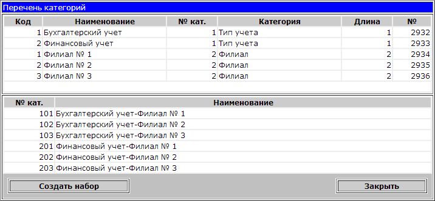

# Фильтры по филиалам

  
nrset \(УФО и филиалы\)

Структура таблиц:

Табл / вьюхи:

\*strgrp\*.

В таблице TMS\_STRGRPM указывается id и имя класса. Для nrset id=-1. Таблица класов.

В таблице TMS\_STRGRPMARRMF указывается уровень\(id\_level\), категория класса\(listname\), маска\(smask\), длина маски и тип \(kind=U для id\_level=1 kind=C для id\_level=2\) - поле обязательно должно быть заполнено \(U - для УФО С - для филиала\). \(при этом в поле id\_m задается id класса\). Описывает из каких справочников состоит этот клас.

В таблице TMS\_STRGRPL указываются позиции для каждой категории, при этом в поле id\_m задается id класса, id\_level - уровень. Позиции самого справочника.

Свойства конфигуратора для настройки nrset:

AutoShowForm String Стартовая форма

BG\_FILTER\_SECTION String Форма фильтра по NrSet

XDEF\_BGFILTER String Фильтр по умолчанию

XDEF\_NRSET String NrSet по умолчанию

XDEF\_NRSET\_VIEW String Ограничение по NrSet

HideNrsetFilter Boolean Скрыть фильтр по NrSet

Подробное описание свойств конфигуратора:

AutoShowForm 

Имя секции формы, которую нужно показывать сразу после запуска программы. 

Этот параметр не обрабатывается, если указан параметр BG\_FILTER\_SECTION. 

BG\_FILTER\_SECTION 

Если этот параметр не пустой, то сразу после запуска программы открывается окно установки фильтра по NrSet либо \(при непустом значении параметра XDEF\_BGFILTER\) фильтр по NrSet устанавливается автоматически и форма не показывается. 

XDEF\_BGFILTER 

Начальное значение фильтра по NrSet: здесь нужно перечислить через запятую коды тех позиций фильтра, которые должны быть изначально включены. \(Имеются в виду коды, которые можно увидеть в последнем столбце верхней таблицы в окне установки фильтра по NrSet - колонка "№"\). Вместо списка кодов можно ввести символ "\*", что означает "включить все". 

XDEF\_NRSET 

Начальное значение NrSet по умолчанию. 

XDEF\_NRSET\_VIEW 

Список кодов NrSet, которыми ограничиваются права пользователя. 

HideNrsetFilter 

Не отображать установленный фильтр по NrSet.

Настройка Фильтра по Nrset в Уне.

Фильтр по NrSet

 Этот фильтр позволяет ограничить просмотр документов пользователем по нескольким независимым критериям. 

 В зависимости от настроек пользователь может или не может изменять этот фильтр, видит или не видит значение установленного фильтра, и выбор его тоже можно ограничить настройками. Если не задано значение фильтра по умолчанию, то при старте программы Universal Accounting SL автоматически открывается форма для установки фильтра. 

 Для включения режима использования фильтра по NrSet достаточно добавить следнующее свойство в секции администратора "System settings": 

BG\_FILTER\_SECTION=1

 Значение свойства может быть любой непустой строкой.

 Для вставки свойства в администратор скопируйте в буфер обмена следующий текст: 

\[ZZZ\]

BG\_FILTER\_SECTION=1

.type.BG\_FILTER\_SECTION=String

 После этого достаточно обновить конфигурацию в запущенной программе Universal Accounting SL, и в главном окне программы на панели инструментов появится кнопка "Sub SET". Эта кнопка открывает окно установки фильтра:

_рис. 1. Окно установки фильтра по NrSet_

Кнопка "Редактировать список", в свою очередь, открывает окно с двумя таблицами, расположенными одна под другой:

_Рис. 2. Список категорий фильтра по NrSet_

Для добавления элементов фильтра достаточно добавить записи в верхнюю таблицу, записи в нижней таблице появляются автоматически. 

 Элементы фильтра могут относиться к разным категориям. Например, бухгалтерия бюджетных предприятий подразумевает разделение документов по источникам финансирования \(бюджет или иные источники\) и по подразделениям \(филиалы и главный офис\). При вводе новой строки важно обязательно указать значения первых трех столбцов - Код и Наименование элемента фильтра, а также "№ кат." - номер категории элемента фильтра. Когда код категории вводится впервые, надо также указать ее название \(столбец "Категория"\) и количество символов кода \(столбец "Длина"\). При вводе кода уже имеющейся категории остальные поля можно не заполнять. Последний столбец "№" заполнять не нужно.

Описание настройки Фильтра по NrSet в Уне можно найти в папке Good:

Good/un4setup/nrset.html

Известные проблемы

При следующей ошибке

Error setting policy level:

ORA-20000: Access denied to this level of policy!

ORA-06512: íà  "AUROMEX.BG\_POLICY", line 195

ORA-06512: íà  line 1

Нужно посмотреть InitSQL. В нем должна быть строка :res := 1;

**Universal Accounting**

**Установка фильтра по филиалам**

Для работы фильтра нужны следующие компоненты БД:

* **package** UN4PUBLIC.UN$DIV
* **context** UN$DIV \(создается командой UN$DIV.InitObjects\(\) от имени UN4PUBLIC\)
* **table** TMS\_UNIV\_DIV
* **trigger** TMDB\_CM\_TRDIV
* **trigger** TMDB\_DOCS\_TRDIV
* **trigger** TMS\_UNIVERS\_TRDIV
* набор **policies** \(создается командой UN$DIV.InitPolicies\(\) от имени рабочей схемы\)

Алгоритм предусматривает  фильтрацию журнала документов и проводок, а также трех разделов универсального справочника: «Подразделения» \(O,I\), «Сотрудники» \(O,R\) и «Основные средства» \(F\).

Перечень филиалов заполняется в универсальном справочнике в разделе «Филиалы» \(O,DIV\).

Управление фильтром заключается в установке следующих значений:

* список кодов филиалов, данные по которым доступны для просмотра и редактирования
* код текущего филиала \(присваивается новым документам и элементам справочника\)
* признаки фильтрации отдельных разделов универсального справочника

Для настройки работы фильтра используются свойства узлов «General», пользователя и группы.

Вот перечень этих свойств:

| **Имя свойства** | **Тип** | **Описание** | **Значение для примера** |
| --- | --- | --- | --- | --- | --- | --- | --- | --- | --- | --- | --- |
|   |   | **Управление значением фильтра по филиалам**  |   |
| DivVisible  | Boolean  | Включает видимость контрола, при помощи которого можно изменять значение фильтра  | false  |
| DivDefault  | String  | Начальное значение фильтра – список кодов филиалов  |   |
| DivCurrent  | Integer  | Начальное значение кода текущего филиала  |   |
|   |   | **Управление признаками фильтрации разделов универсального справочника**  |   |
| DivVisibleOR  | Boolean | Включает видимость контрола  | false  |
| DivDefaultOR | Boolean | Начальное значение признака  | false  |
| DivVisibleOI  | Boolean | Включает видимость контрола  | false  |
| DivDefaultOI  | Boolean | Начальное значение признака  | false  |
| DivVisibleF  | Boolean | Включает видимость контрола | false  |
| DivDefaultF  | Boolean | Начальное значение признака | false  |

