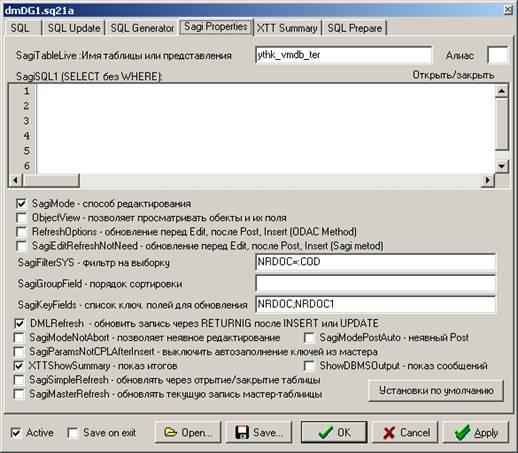

# Настройка SagiProperties

 **Минимальный набор настроек** _**SAGIProperties**_

Редактирование поля без **F4 –** в дизайне формы выставить в свойствах выбранного поля:

**Other Field Properties**: Input mode: **KeyBoard Mode = 2**

Добавление **фильтров** к **Univers:**

Пример: Attribute = T, **Grouping = COST\cod in \(60086,60089,60088\).**

Чтобы обратиться к дате в шапке формы/документа:

_**`TO_DATE(SYS_CONTEXT('ENVUN4','V_DATAB')`**_

\( Font: Wingdings 2  если в поле **символ P** , на его месте **появится галочка**\)

CheckMark=1 + галка ReadOnly + \(по желанию, шрифт Windings2 жирный зеленый 14\)

=&gt; двойной клик левой кнопкой мыши ставит в ячейку галку/указанную цифру/букву/и т.п.

**В формах с подчиненным гридом**, то есть когда

                                                           **FormUseDetail=true**

Необходимо убрать пробелы из условия **where** в **Sagi Properties** чтобы работали параметры, которые берутся из верхнего грида.

  Пример правильного фильтра:

                                                           **`ID_M=:ID_M AND ID_D1=:ID_D1`**

Пример неправильного фильтра:

                                                           **`ID_M = :ID_M AND ID_D1 = :ID_D1`**

В документах и формах **вычисляемые поля** должны иметь тот же корень, что и поле с **кодом.**

Например: **cod\_munc, clccod\_munct.**

Иначе значение поля в клиенте **невозможно удалить**, можно только заменить на другое.

