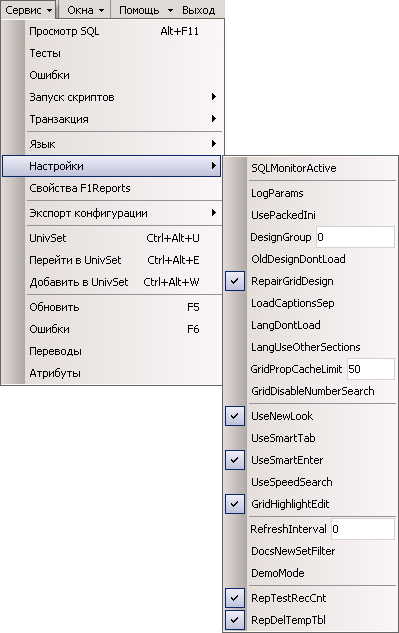

# Панель

Меню программы.

Во время выполнения программы можно менять некоторые параметры.

Имеет наивысший приоритет, но время действия настроек ограничено сеансом.

| **Имя свойства** | **Тип** | **Описание** | **Значение для примера** |
| :--- | :---: | :--- | :--- |
| Language | String | Язык интерфейса. Язык интерфейса задается либо цифрой \(0, 1, 2\), либо буквой \(E, M, R\). Язык окна регистрации  задается только методом File. Если язык не задан ни одним из методов,  система переводов выключается на весь сеанс работы. |  |
|  |  | **Загрузка настроек, дизайнов, переводов и т.п.:** |  |
| LogParams | Boolean | Контроль настроек. Режим записи в текстовый файл всех считываемых настроек  \(до и после обработки  и фильтрации\). |  |
| GridPropCacheLimit | Integer | Размер кеша дизайнов. Максимальный размер кеша дизайнов в памяти. За единицу берется один тип  документа, один узел дерева отчетов,  одна форма или справочник. |  |
| RepairGridDesign | Boolean | Исправление ошибок. Режим автокоррекции загружаемых дизайнов \(бывает нужен при работе с ORACLE 9i\). |  |
| LangDontLoad | Boolean | Не загружать переводы. Не пытаться загружать тексты переводов из ORACLE  \(для уменьшения  траффика\). |  |
| LoadCaptionsSep | Boolean | Заголовки отдельно. Режим раздельной загрузки переводов заголовков столбцов и дизайнов  \(для совместимости с переводами заголовков столбцов, сохраненными в предыдущих версиях SL\). |  |
|  |  | **Ограничение прав пользователей:** |  |
| DesignGroup | Integer | Номер группы дизайнов \(ненулевое значение позволяет пользователю иметь персональные  дизайны, переводы, схемы отчетов и т.п.\). Администратор может менять себе этот номер  во время выполнения программы \(через интерфейс меню\). |  |
|  |  | **Панели инструментов:** |  |
| TBIconStyle | Integer | Расположение значков. Число от 0 до 3 означает положение значка относительно пункта главного меню: 0 - Значки не выводятся на экран \(в меню - только надписи\);  1 - Надписи не выводятся на экран \(в меню - только значки\);   2 - Значки выводятся на экран слева от соответствующих надписей;  3 - Значки выводятся на экран над соответствующими надписями. |  |
| TBIconSize | Integer | Размер значков. Число от 0 до 2 означает размер значков в главного меню:  0 - Мелкие значки;  1 - Средние значки;  2 - Крупные значки. |  |
| TBPeriod | Boolean | Панель периодов. Отображать на экране панель ввода периодов. |  |
| TBWindowList | Boolean | Панель открытых окон. Отображать на экране панель открытых окон. |  |
|  |  | **Настройка окна регистра документов:** |  |
| ViewBegin | String | Ограничение снизу. Минимальная дата отображаемых документов |  |
| ViewEnd | String | Ограничение сверху. Максимальная дата отображаемых документов |  |
| PXCMSimpleEditing | Boolean | Режим быстрой правки. Режим быстрой правки проводок документов версии PX. |  |
|  |  | **Настройка окна менеджера отчетов:** |  |
| RepDataStart | String | Дата начала периода просмотра данных в отчетах. Допускается SQL-выражение.  Если значение параметра отсутствует, вместо него используется значение параметра PeriodStart |  |
| RepDataEnd | String | Дата окончания периода просмотра данных в отчетах. Допускается SQL-выражение.  Если значение параметра отсутствует, вместо него используется значение параметра PeriodEnd |  |
| RepTestRecordCount | Boolean | Проверять к-во записей. Режим проверки количества записей в наборе данных отчета \(для F1Reports\):   при очень большом количестве записей выдается предупреждающее сообщение, имеется возможность  отменить построение отчета или вручную ограничить количество выводимых записей.  Предельное количество записей для отчетов Master/Detail - 1000, только Master - 10000. |  |
| RepDeleteTempTables | Boolean | Удалять врем. таблицы. Режим удаления временных таблиц  ORACLE после построения отчета \(можно выключить\). |  |
|  |  | **Разные настройки:** |  |
| GridDisableNumberSearch | Boolean | Запрет числового поиска. Режим текстового поиска даже в  числовых полях грида \(вместо числового поиска\). |  |
| UseSmartTab | Boolean | "Умный" &lt;Tab&gt;. Режим интеллектуального поведения клавиши  &lt;Tab&gt;: переход от поля к полю по всему  активному окну. |  |
| UseSmartEnter | Boolean | "Умный" &lt;Enter&gt;. Режим интеллектуального поведения клавиши  &lt;Enter&gt; на дополнительной \(цифровой\)  клавиатуре:  при редактировании таблиц - переход к следующему полю или \(из последнего столбца\)  завершение редактирования и вставка новой записи. |  |
| UseSpeedSearch | Boolean | Быстрый поиск в справ.. Режим быстрого поиска в выпадающих справочниках. |  |
|  |  | **Отладочные возможности:** |  |
| SQLMonitorActive | Boolean | Включение SQLMonitor. Включить SQLMonitor  \(соединение с программой SQLMonitor и протоколирование обращений к серверу\). |  |

[Кнопка ](knopka.md)\(button\)

